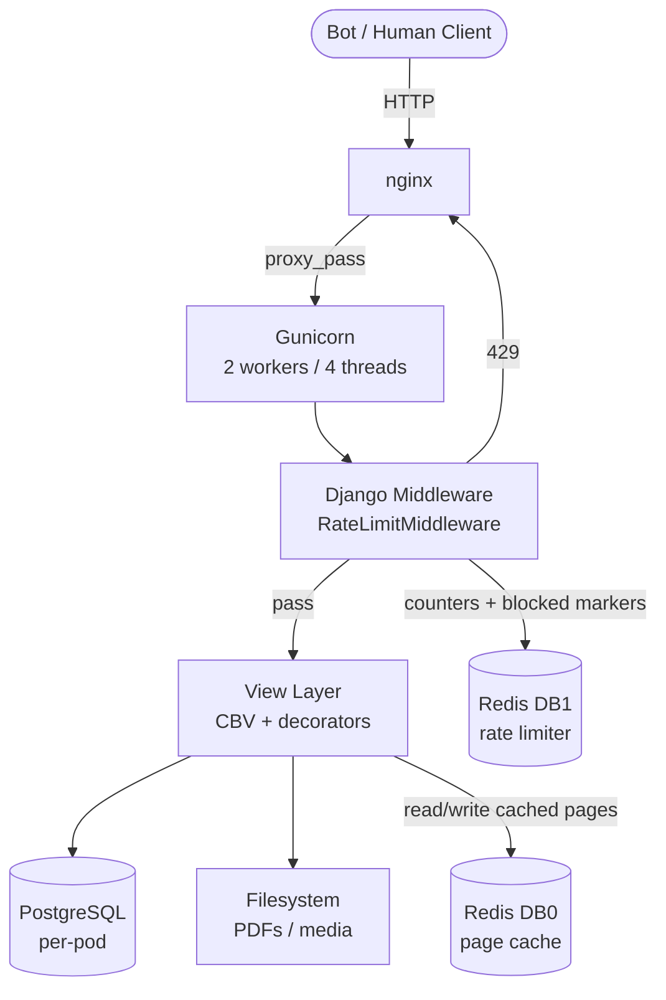
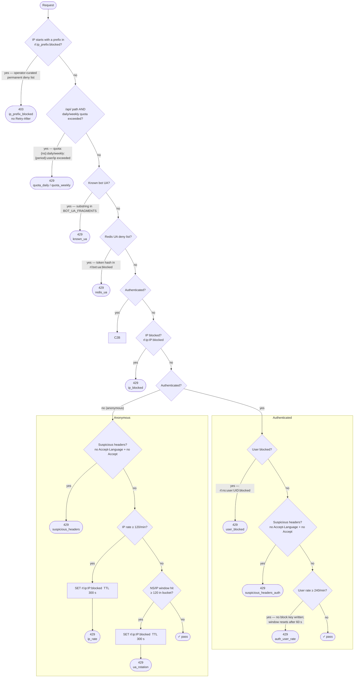

# SAPL — Rate Limiter & Redis Operations

> **Scope**: Django / Gunicorn / nginx / Kubernetes fleet of 1,200+ pods.
> Each pod has a dedicated PostgreSQL instance. A K8s Ingress sits in front of all tenants.
> **This document is canonical** — all earlier session notes are consolidated here.

---

## Context & Problem Statement

### Fleet

| Item | Detail |
|------|--------|
| System | SAPL — Django 2.2, legislative management for Brazilian municipal chambers |
| Fleet | ~1,200 Kubernetes pods, each with a dedicated PostgreSQL pod |
| Pod limits | 1 core CPU (limit) / 35m (request) · 1600Mi RAM (limit) / 800Mi (request) |
| Users | Legislative house staff, often behind NAT (many users, one public IP) |
| Workloads | PDF generation (synchronous, ReportLab), file uploads up to 150 MB, WebSocket voting panel |

### OOM Kill Pattern

Workers grow from ~35 MB at birth to 800–900 MB within 2–3 minutes, then are killed and replaced in a continuous cycle.

Root causes:
- Bot scraping triggers synchronous PDF generation — entire document built in RAM (ReportLab)
- `worker_max_memory_per_child` only checks **between requests**; workers blocked on long requests are never recycled
- `TIMEOUT=300` lets bots hold threads for up to 5 minutes while memory accumulates
- 3 workers × 300 MB each = ~900 MB — breaching the 800Mi request threshold

### Bot Traffic Profile (Barueri pod, 16 days, 662 k requests)

| Actor | Requests | % of total |
|-------|----------|-----------|
| Googlebot | ~154,000 | 23.2% |
| Chrome/98.0.4758 (spoofed scraper) | 90,774 | 13.7% |
| kube-probe (healthcheck) | 69,065 | 10.4% |
| meta-externalagent | 28,325 | 4.3% |
| GPTBot | 11,489 | 1.7% |
| bingbot | 7,639 | 1.1% |
| OAI-SearchBot + Applebot | 6,681 | 1.0% |
| **Total identified bots** | **~377,000** | **~56.9%** |

**Botnet fingerprint:**
- Rotates User-Agents (Chrome/121, Chrome/122, Firefox/123, Safari/17…) across requests
- Crawls all sub-endpoints of the same matéria within 1 second from different IPs
- Distributes crawling across tenants — each pod stays under the per-pod rate limit, never triggering it
- Primary targets: `/relatorios/{id}/etiqueta-materia-legislativa` (~40 KB PDF) and all `/materia/{id}/*` sub-endpoints

### Static File Traffic (from CSV analysis)

| Category | Requests | Transfers |
|----------|----------|----------|
| Logos / images | 62,776 | ~24 GB |
| PDFs | 8,869 | 5.1 GB |
| Parliamentarian photos | 11,856 | ~0.5 GB |
| **Total** | **83,501** | **~30 GB** |

Top offender: `Brasão - Foz do Iguaçu.png` — 14,512 requests, 5.6 GB from a single 392 KB file.

### Hard Constraints

| Constraint | Impact |
|------------|--------|
| Per-pod PostgreSQL | Rate-limit counters not shared across pods |
| NAT environments | IP-based rate limiting causes false positives |
| `TIMEOUT=300` / uploads to 150 MB | Must not be broken — intentional for slow workflows |

---

## Architecture Overview

### Component Diagram



> DB2 is reserved for Django Channels (WebSocket — future).

### Redis Memory Budget

| Key type | Key schema | TTL | DB | Est. size |
|----------|-----------|-----|----|----------|
| Page / view cache | `cache:{ns}:*` | 60–600 s | 0 | ~0.5 GB |
| Static cache (images/logos) | `static:{ns}:{sha256}` | 3–24 h | 0 | ~2.4 GB |
| IP request counter | `rl:ip:{ip}:reqs` | 60 s | 1 | ~0.6 MB |
| IP blocked marker | `rl:ip:{ip}:blocked` | 300 s | 1 | ~0.06 MB |
| Blocked-IP index | `rl:index:blocked_ips:{0..N-1}` | self-pruning ZSET (N=3) | 1 | ~0.01 MB |
| User request counter | `rl:{ns}:user:{uid}:reqs` | 60 s | 1 | negligible |
| User blocked marker | `rl:{ns}:user:{uid}:blocked` | 300 s | 1 | negligible |
| Blocked-user index | `rl:index:blocked_users` | permanent ZSET | 1 | negligible |
| Path counter | `rl:{ns}:path:{sha256}:reqs` | 60 s | 1 | ~0.3 MB |
| UA deny list | `rl:bot:ua:blocked` | permanent SET | 1 | ~0.03 MB |
| IP-prefix deny list | `rl:ip_prefix:blocked` | permanent SET | 1 | ~0.01 MB |
| NS/IP/window counter | `rl:{ns}:ip:{ip}:w:{bucket}` | 120 s | 1 | ~0.6 MB |
| API daily quota (all callers, by IP) | `quota:{ns}:daily:{date}` (HASH, field=ip) | 24 h | 1 | ~32 MB at 1 200 tenants |
| API weekly quota (all callers, by IP) | `quota:{ns}:weekly:{week}` (HASH, field=ip) | 7 d | 1 | ~158 MB at 1 200 tenants |
| API rate counter (ns-scoped) | `rl:api:ns:{ns}:ip:{ip}:reqs` | 60 s | 1 | negligible |
| API block marker (ns-scoped) | `rl:api:ns:{ns}:ip:{ip}:blocked` | 60 s | 1 | negligible |
| Block metrics (HASH) | `rl:metrics:{ns}:{date}` (HASH, field=reason) | 8 d | 1 | ~0.5 MB |
| Redis overhead (× 1.5) | | | | ~1.6 GB |
| **Total ceiling** | | | | **~5 GB** |

---

## Decision Log

| Decision | Chosen | Rationale |
|----------|--------|-----------|
| Redis topology | **Single pod** (no Sentinel, no Cluster) | 65 MB of active data fits comfortably; cluster complexity not justified |
| PDF caching in Redis | **No** — ETags + sendfile are sufficient | Once rate limiting + ETags are active, repeat requests become 304s with zero bytes transferred |
| HTTP conditional requests | **`ConditionalGetMiddleware` + `@condition` decorator** | `ConditionalGetMiddleware` handles ETag/304 for all views; `@condition(etag_func, last_modified_func)` on materia/norma detail views skips view execution entirely on cache hit |
| Upload endpoint special-casing (nginx) | **Removed** — fall through to `location /` | No justification for separate `limit_req` zone; `location /` with `sapl_general` covers it |
| Static asset cache policy | **90 min** (`expires 90m`, `max-age=5400`) | Conservative — safe with `collectstatic` content-hashed filenames; `immutable` not used (would require verified forever-hashed URLs) |
| Rate-limit enforcement | **Django middleware** with shared Redis | No nginx image changes required; solves cross-pod consistency immediately |
| `worker_max_memory_per_child` | **400 MB** | Pod limit 1600Mi, 2 workers × 400 MB = 800 MB — leaves 800 Mi headroom |
| `sendfile off` → `on` | **Bug** — flip to `on` | No valid production reason found; disabling userspace copy is always correct |
| `/media/` serving | **X-Accel-Redirect** | Routes all `/media/` through Gunicorn so Django middleware runs; nginx serves bytes via internal location |
| Cache backend switch | **At pod startup** via `start.sh` + waffle switch | Pod restart is acceptable; avoids per-request runtime overhead |
| nginx zone splitting (2026-05-07) | **4 zones**: general / media / api / heavy | `/media/` and `/api/` requests were draining the same bucket as HTML page loads, causing false 429s on heavy pages |
| Session/voting nginx bypass (2026-05-06) | **No `limit_req`** on `/voto-individual/` and `/sessao/<pk>/` | Multiple councilmembers behind a NAT IP exhausted the nginx burst during live votes (PatoBranco-PR incident) |
| Auth rate breach: no persistent block (2026-05-07) | **429 per-request only**, window resets after 60 s | A 300 s lockout is the wrong penalty for a logged-in user who clicked too fast; persistent block is appropriate for anonymous/bot traffic only |
| Raise rate thresholds (2026-05-07) | anon 35→120/m · auth 120→240/m · 404 threshold 10→20 | SAPL pages fire 12–45 parallel requests; old thresholds blocked normal navigation for users in offices with multiple open tabs |
| API quota increase (2026-05-07) | anon 50→500/day · auth 1 000→5 000/day | Previous anon quota of 50/day was exhausted by a developer testing the API before lunch |
| Auth not exempt from `/api/` rate limit (2026-05-11) | **All callers keyed by IP** — auth status not checked | Authenticating must not bypass the per-minute cap; `_evaluate` (240/min per-user) still governs non-`/api/` paths |
| Auth-specific API quotas removed (2026-05-11) | **Single `API_QUOTA_DAILY/WEEKLY`** for all callers by IP | Per-user quota added false precision; IP-based cap is sufficient alongside the per-minute block |
| API rate limit keys namespaced (2026-05-11) | `rl:api:ns:{ns}:ip:{ip}:reqs/blocked` | Without `{ns}` a block in one k8s pod namespace leaked into all tenants sharing the same Redis instance |
| API threshold raised (2026-05-11) | 60→120 req/min | Aligns with legitimate integration patterns; slow-drip abuse is caught by the daily quota |
| API block TTL reduced (2026-05-11) | 300→60 s | Shorter cooldown reduces false-positive lockout duration for shared IPs |
| API quota raised (2026-05-11) | 1 000→100 000/day · 7 000→700 000/week | Quota serves as outer envelope for all-day slow scrapers; 1 000/day was exhausted too quickly for legitimate integrations |
| IP-prefix deny list added (2026-05-11) | `rl:ip_prefix:blocked` permanent SET, dot-boundary-anchored prefix match (`df2f5ee30`) | Operators need to block whole ranges (e.g. `103.124.225.*`) at runtime by curating prefixes, not individual IPs; mirrors the existing `rl:bot:ua:blocked` runtime-deny-list pattern |
| Same-origin bypass moved after block checks (2026-05-11) | `_is_same_origin` now runs *after* the IP-prefix / global-IP / API-IP block checks in `_handle_api` (`5f71354f5`) | `Origin`/`Referer` are client-controlled and trivially spoofable; the bypass was short-circuiting before `ip = get_client_ip(request)` and before every block lookup, letting a forged `Origin` header defeat an operator-set `rl:ip:<ip>:blocked` key entirely |
| Metrics key format consolidated to HASH (2026-06-09) | `rl:metrics:{ns}:{date}` HASH (field = reason) instead of `rl:metrics:{ns}:{date}:blocked:{reason}` STRING per reason (`d0eb02d27`) | With 1,200 tenants sharing one Redis instance, the old design produced up to 96 k live STRING keys (1,200 × ~10 reasons × 8-day TTL); each increment issued a Lua eval whose event-loop lock adds latency to all Redis commands when many tenants are under simultaneous attack. HASH consolidation reduces to 9,600 keys (10× fewer), reuses the existing `_hincrby_with_ttl` function, and makes monitoring simpler (`HGETALL` returns all reasons in one round-trip) |

---

## Directory layout

```
docker/k8s/
└── redis/
    ├── redis-configmap.yaml    # redis.conf — no persistence, allkeys-lru, 5 GB ceiling
    ├── redis-deployment.yaml   # Deployment (1 replica, redis:7-alpine)
    └── redis-service.yaml      # ClusterIP service on port 6379
```

---

## Prerequisites

- `kubectl` configured to talk to the target cluster.
- A `sapl-redis` namespace (created below if it doesn't exist).

---

## Deploy

```bash
# 1. Create the namespace (idempotent)
rancher kubectl create namespace sapl-redis --dry-run=client -o yaml | rancher kubectl apply -f -

# 2. Apply all three manifests
rancher kubectl apply -f docker/k8s/redis/redis-configmap.yaml
rancher kubectl apply -f docker/k8s/redis/redis-deployment.yaml
rancher kubectl apply -f docker/k8s/redis/redis-service.yaml

# 3. Verify the pod is Running
rancher kubectl -n sapl-redis get pods -l app=sapl-redis
```

Expected output:
```
NAME                          READY   STATUS    RESTARTS   AGE
sapl-redis-6d9f8b7c4d-xk2lm   1/1     Running   0          30s
```

---

## Verify the rate limiter

### Canary tenants

Current canary namespaces receiving the `rate-limiter-2026` image:

```
joaopessoa-pb  patobranco-pr  al-am  al-pi  al-ro  divinopolis-mg
```

Verify image digest, `imagePullPolicy: Always`, and `REDIS_URL` for all six at once:

```bash
# From monitoring_metrics-2025-2026/logs/cluster-prod/
bash check-canary-tenants.sh
```

Expected: all checks green and the same `sha256` digest across all pods.

---

### Functional test

`scripts/test_ratelimiter.py` fires repeated GET requests at a SAPL URL and reports
when the first 429 is returned.

### Usage

```
python scripts/test_ratelimiter.py <URL> [-n NUM] [-d DELAY] [-t TIMEOUT]
```

| Flag | Default | Meaning |
|------|---------|---------|
| `url` | *(required)* | Full URL including scheme, e.g. `http://localhost` |
| `-n`, `--num-requests` | `50` | Maximum requests to send |
| `-d`, `--delay` | `0.1` | Seconds between requests |
| `-t`, `--timeout` | `10` | Per-request timeout in seconds |

The script stops and prints a summary as soon as a 429 is received.

### Examples

```bash
# Hit the anonymous threshold (120 req/min) — fire 130 requests with minimal delay
python scripts/test_ratelimiter.py http://localhost -n 130 -d 0.05

# Slower fire — check that legitimate traffic is not rate-limited
python scripts/test_ratelimiter.py http://localhost -n 20 -d 2

# Test against a staging pod via port-forward
rancher kubectl port-forward -n <NAMESPACE> deploy/sapl 8080:80 &
python scripts/test_ratelimiter.py http://localhost:8080 -n 40 -d 0.05
```

### Reading the output

```
Request   1: Status 200 | Time: 0.045s
...
Request  36: Status 429 | Time: 0.038s
  -> Rate limited on request 36

Summary:
  Total requests attempted: 36
  Successful (200):          35
  Rate limited (429):        1
  First 429 occurred at request: 36
```

A first-429 near the configured anonymous threshold (120 req/min) confirms the
middleware is wired correctly. A first-429 much earlier points to nginx `limit_req`
firing before Django sees the request.

---

## Inject REDIS_URL into SAPL instances

`REDIS_URL` points at the shared instance:

```
redis://redis.sapl-redis.svc.cluster.local:6379
         ^^^^^  ^^^^^^^^^^
         svc    namespace
```

`start.sh` picks it up on every pod startup and sets the `REDIS_CACHE` waffle switch
automatically — no further intervention needed.

### Fleet-wide rollout

Uses the `app.kubernetes.io/name=sapl` pod label to discover every SAPL namespace
automatically — onboarding a new municipality requires no script changes.

```bash
for ns in $(rancher kubectl get pods -A -l app.kubernetes.io/name=sapl \
  -o jsonpath='{.items[*].metadata.namespace}' | tr ' ' '\n' | sort -u); do
  rancher kubectl set env deployment/sapl \
    REDIS_URL=redis://redis.sapl-redis.svc.cluster.local:6379 \
    -n $ns
done
```

### Roll back

```bash
for ns in $(rancher kubectl get pods -A -l app.kubernetes.io/name=sapl \
  -o jsonpath='{.items[*].metadata.namespace}' | tr ' ' '\n' | sort -u); do
  rancher kubectl set env deployment/sapl REDIS_URL- -n $ns
done
```

`kubectl set env deployment/sapl REDIS_URL-` (trailing `-`) removes the variable.
`start.sh` then falls back to file-based cache automatically.

---

## Monitor

### Pod and events

```bash
# Pod status
rancher kubectl -n sapl-redis get pods -l app=sapl-redis -o wide

# Deployment events (useful right after apply)
rancher kubectl -n sapl-redis describe deployment sapl-redis

# Pod events (OOMKill, restarts, etc.)
rancher kubectl -n sapl-redis describe pod -l app=sapl-redis
```

### Logs

```bash
# Tail live logs
rancher kubectl -n sapl-redis logs -f deploy/sapl-redis

# Last 100 lines
rancher kubectl -n sapl-redis logs deploy/sapl-redis --tail=100
```

### Redis INFO

```bash
# Memory usage
rancher kubectl exec -n sapl-redis deploy/sapl-redis -- \
  redis-cli info memory \
  | grep -E 'used_memory_human|maxmemory_human|mem_fragmentation_ratio'

# Connection pressure
rancher kubectl exec -n sapl-redis deploy/sapl-redis -- \
  redis-cli info stats \
  | grep -E 'rejected_connections|instantaneous_ops_per_sec'

# Key distribution per DB
rancher kubectl exec -n sapl-redis deploy/sapl-redis -- redis-cli info keyspace

# Recent slow queries
rancher kubectl exec -n sapl-redis deploy/sapl-redis -- redis-cli slowlog get 10

# Live command sampling (1-second window)
rancher kubectl exec -n sapl-redis deploy/sapl-redis -- redis-cli --latency-history -i 1
```

### Rate-limiter keys (DB 1)

```bash
rancher kubectl exec -n sapl-redis deploy/sapl-redis -- \
  redis-cli -n 1 dbsize

# All rate-limiter keys for an IP prefix
rancher kubectl exec -n sapl-redis deploy/sapl-redis -- \
  redis-cli -n 1 --scan --pattern 'rl:ip:*' | head -20

# All currently blocked IPs (legacy SCAN — use ZSET index below instead)
rancher kubectl exec -n sapl-redis deploy/sapl-redis -- \
  redis-cli -n 1 --scan --pattern 'rl:ip:*:blocked'
```

Via port-forward (local machine — run `kubectl port-forward svc/redis -n sapl-redis 6379:6379` first):

```bash
# All active blocked IPs via sharded ZSET index (O(log N), no SCAN)
# IPs are distributed across N shards (default 3) via md5(ip) % N.
NOW=$(date +%s)
for i in 0 1 2; do
  redis-cli -n 1 ZRANGEBYSCORE rl:index:blocked_ips:$i $NOW +inf WITHSCORES
done

# All active blocked users via ZSET index
redis-cli -n 1 ZRANGEBYSCORE rl:index:blocked_users $NOW +inf WITHSCORES

# Count of currently active blocked IPs (sum across shards)
for i in 0 1 2; do
  redis-cli -n 1 ZCOUNT rl:index:blocked_ips:$i $NOW +inf
done

# Pruning is automatic — each _set_block write prunes expired entries from its
# shard inline (ZREMRANGEBYSCORE inside _BLOCK_LUA). Manual pruning no longer needed.
# To prune the legacy unsharded key (harmless; expires within one BLOCK_TTL after deploy):
redis-cli -n 1 DEL rl:index:blocked_ips rl:index:api_blocked_ips

# Legacy: blocked IPs with value and remaining TTL (still works; slower on large key spaces)
redis-cli -n 1 --scan --pattern 'rl:ip:*:blocked' | while read key; do
  echo "$key → $(redis-cli -n 1 GET $key) (TTL: $(redis-cli -n 1 TTL $key)s)"
done
```

---

## Seed the UA deny list (once after first deploy)

`rl:bot:ua:blocked` is a permanent Redis SET in DB 1.  Each member is the
SHA-256 of a **UA token** — the identifying fragment extracted after splitting
on `/`, spaces, `;`, `(`, `)`, e.g.:

```
UA string:  "GPTBot/1.1 (+https://openai.com/gptbot)"
Tokens:      GPTBot  1.1  +https:  ...
Hash stored: sha256("GPTBot")
```

The middleware (`_is_redis_blocked_ua`) tokenises the incoming UA the same
way and checks each token hash against the cached set.  The SET is fetched
from Redis at most once per `RATE_LIMITER_UA_BLOCKLIST_REFRESH` seconds (default 60)
per worker process.

The bots in `BOT_UA_FRAGMENTS` (Python list, always active) and this Redis
SET are **independent** — the Python list provides the baseline and the Redis
SET allows adding new offenders at runtime **without a code deploy**.

```bash
rancher kubectl exec -n sapl-redis deploy/sapl-redis -- redis-cli -n 1 \
  SADD rl:bot:ua:blocked \
    "$(echo -n 'GPTBot'             | sha256sum | cut -d' ' -f1)" \
    "$(echo -n 'ClaudeBot'          | sha256sum | cut -d' ' -f1)" \
    "$(echo -n 'PerplexityBot'      | sha256sum | cut -d' ' -f1)" \
    "$(echo -n 'Bytespider'         | sha256sum | cut -d' ' -f1)" \
    "$(echo -n 'AhrefsBot'          | sha256sum | cut -d' ' -f1)" \
    "$(echo -n 'meta-externalagent' | sha256sum | cut -d' ' -f1)"
    "$(echo -n 'OAI-SearchBot'      | sha256sum | cut -d' ' -f1)"
    "$(echo -n 'quiltbot'           | sha256sum | cut -d' ' -f1)"
    "$(echo -n 'Googlebot'          | sha256sum | cut -d' ' -f1)"
    "$(echo -n 'Applebot'           | sha256sum | cut -d' ' -f1)"
    "$(echo -n 'meta-webindexer'    | sha256sum | cut -d' ' -f1)"
    "$(echo -n 'AwarioBot'          | sha256sum | cut -d' ' -f1)"

# Add a new offender at runtime (picked up within RATE_LIMITER_UA_BLOCKLIST_REFRESH seconds)
rancher kubectl exec -n sapl-redis deploy/sapl-redis -- redis-cli -n 1 \
  SADD rl:bot:ua:blocked "$(echo -n 'NewBot' | sha256sum | cut -d' ' -f1)"
```

---

## Manage the IP-prefix deny list (`rl:ip_prefix:blocked`)

`rl:ip_prefix:blocked` (constant `RL_IP_PREFIX_BLOCKLIST`, added in `df2f5ee30`) is a
**permanent Redis SET in DB 1**. Each member is a dotted-decimal **prefix string**
such as `103.124.225` or `45.177.154` — or a complete dotted-quad address such as
`201.23.71.13` to block one specific IP. Any client IP that starts with a stored
prefix on a **dot boundary** is blocked, e.g. `103.124.225` matches `103.124.225.7`
but not `103.124.2250.1` or `103.124.2255` (an octet-aligned, /24-ish range match —
not a raw string prefix). A stored entry that is already a full 4-octet address
(no trailing dot) is matched by equality only.

This check runs **before everything else** — both at the top of `_evaluate` (non-`/api/`
paths) and at the top of `_handle_api` (`/api/` paths) — and applies universally to
**all traffic**: anonymous, authenticated, `/api/` and regular paths alike. It mirrors
the `rl:bot:ua:blocked` runtime-deny-list pattern: the SET is fetched via `SMEMBERS`
at most once per `RATE_LIMITER_IP_PREFIX_BLOCKLIST_REFRESH` seconds (default `60`)
per worker process, so additions/removals take effect fleet-wide without a code deploy
or restart — only the in-process cache refresh delay.

### Populate — block a range or a single IP

```bash
# Block an entire /24-ish range by prefix (matches 103.124.225.0 – 103.124.225.255)
rancher kubectl exec -n sapl-redis deploy/sapl-redis -- redis-cli -n 1 \
  SADD rl:ip_prefix:blocked 103.124.225

# Block multiple ranges in one call
rancher kubectl exec -n sapl-redis deploy/sapl-redis -- redis-cli -n 1 \
  SADD rl:ip_prefix:blocked 103.124.225 45.177.154

# Block one specific IP (matched by equality only — no range semantics)
rancher kubectl exec -n sapl-redis deploy/sapl-redis -- redis-cli -n 1 \
  SADD rl:ip_prefix:blocked 201.23.71.13
```

### Remove — unblock a range or a single IP

```bash
rancher kubectl exec -n sapl-redis deploy/sapl-redis -- redis-cli -n 1 \
  SREM rl:ip_prefix:blocked 103.124.225

# Remove multiple entries in one call
rancher kubectl exec -n sapl-redis deploy/sapl-redis -- redis-cli -n 1 \
  SREM rl:ip_prefix:blocked 103.124.225 45.177.154 201.23.71.13
```

### List — inspect the current deny list

```bash
# All prefixes/addresses currently blocked
rancher kubectl exec -n sapl-redis deploy/sapl-redis -- redis-cli -n 1 \
  SMEMBERS rl:ip_prefix:blocked

# Count of entries
rancher kubectl exec -n sapl-redis deploy/sapl-redis -- redis-cli -n 1 \
  SCARD rl:ip_prefix:blocked

# Check whether a specific prefix/address is already in the list
rancher kubectl exec -n sapl-redis deploy/sapl-redis -- redis-cli -n 1 \
  SISMEMBER rl:ip_prefix:blocked 103.124.225
```

Via port-forward (local machine):

```bash
redis-cli -n 1 SADD    rl:ip_prefix:blocked 103.124.225
redis-cli -n 1 SREM    rl:ip_prefix:blocked 103.124.225
redis-cli -n 1 SMEMBERS rl:ip_prefix:blocked
```

> **Note**: changes are picked up by each worker within `RATE_LIMITER_IP_PREFIX_BLOCKLIST_REFRESH`
> seconds (default `60`) — there is no immediate fleet-wide invalidation, by design
> (mirrors `rl:bot:ua:blocked`; avoids a Redis round-trip on every request).

---

## Local standalone Redis (development / testing)

No Kubernetes? Run Redis directly with Docker:

```bash
sudo docker run --rm -p 6379:6379 redis:7-alpine \
  redis-server --save "" --appendonly no
```

Then point Django at it by exporting the env var before starting the dev server:

```bash
export REDIS_URL="redis://localhost:6379"
export CACHE_BACKEND="redis"
python manage.py runserver
```

Or add them to your local `.env` file:

```
REDIS_URL=redis://localhost:6379
CACHE_BACKEND=redis
```

> **Note**: the waffle switch `REDIS_CACHE` must also be `on` in your local
> database for `start.sh` to activate the Redis backend. Run:
> ```bash
> python manage.py waffle_switch REDIS_CACHE on --create
> ```

---

## Update `redis.conf` without redeploying

```bash
# Edit the ConfigMap
rancher kubectl -n sapl-redis edit configmap redis-config

# Restart the pod to pick up the new config
rancher kubectl -n sapl-redis rollout restart deployment/sapl-redis
```

---

## Gunicorn tuning

`docker/startup_scripts/gunicorn.conf.py` — resolved values for the current pod budget (1600Mi RAM, 1 CPU):

```python
NUM_WORKERS = int(os.getenv("WEB_CONCURRENCY", "2"))      # was 3
THREADS     = int(os.getenv("GUNICORN_THREADS", "4"))      # was 8
TIMEOUT     = int(os.getenv("GUNICORN_TIMEOUT", "120"))    # was 300

max_requests                = 1000
max_requests_jitter         = 200
worker_max_memory_per_child = 400 * 1024 * 1024  # 400 MB — was 300 MB
```

**Per-location timeout strategy** — nginx overrides the global Gunicorn timeout per-path:

| Operation | Timeout | Rationale |
|-----------|---------|-----------|
| Normal page rendering | 60 s | No legitimate page should take > 60 s |
| API endpoints | 30 s | Stateless, fast by design |
| PDF download (cached / nginx) | 30 s | nginx serves from disk, worker not involved |
| PDF generation (uncached) | 180 s | Kept high — addressed in a future phase |
| Large file upload | 180 s | nginx buffers upload; worker processes after |

---

## nginx real-IP and core fixes

Added to `docker/config/nginx/nginx.conf` (http {} block):

```nginx
# Kernel bypass — was off (bug)
sendfile    on;
tcp_nopush  on;
tcp_nodelay on;

# Real client IP from X-Forwarded-For set by K8s Ingress
real_ip_header     X-Forwarded-For;
real_ip_recursive  on;
set_real_ip_from   10.0.0.0/8;
set_real_ip_from   172.16.0.0/12;
set_real_ip_from   192.168.0.0/16;
```

Without `real_ip_recursive on`, `$remote_addr` inside the pod would always be the Ingress IP, making IP-based rate limiting and blocking meaningless.

---

## Django upload settings

Added to `sapl/settings.py` — files above 2 MB are streamed to disk rather than held in worker RAM.  Critical for 150 MB upload support without OOM pressure:

```python
FILE_UPLOAD_MAX_MEMORY_SIZE = 2 * 1024 * 1024       # 2 MB
DATA_UPLOAD_MAX_MEMORY_SIZE = 10 * 1024 * 1024      # 10 MB
MAX_DOC_UPLOAD_SIZE         = 150 * 1024 * 1024     # 150 MB
FILE_UPLOAD_TEMP_DIR        = '/var/interlegis/sapl/tmp'
```

---

## N+1 fix — `get_etiqueta_protocolos`

`sapl/relatorios/views.py` — previously called `MateriaLegislativa.objects.filter()` inside a loop over protocols.  Fixed to **three queries total** regardless of volume (one for protocols, one for materias, one for documentos):

```python
# sapl/relatorios/views.py
def get_etiqueta_protocolos(prots):
    prot_list = list(prots)
    if not prot_list:
        return []

    # Pre-fetch MateriaLegislativa for all protocols in one query.
    materia_query = Q()
    for p in prot_list:
        materia_query |= Q(numero_protocolo=p.numero, ano=p.ano)
    materias_map = {
        (m.numero_protocolo, m.ano): m
        for m in MateriaLegislativa.objects.filter(
            materia_query).select_related('tipo')
    }

    # Pre-fetch DocumentoAdministrativo for all protocols in one query.
    documentos_map = {
        doc.protocolo_id: doc
        for doc in DocumentoAdministrativo.objects.filter(
            protocolo__in=prot_list).select_related('tipo')
    }

    protocolos = []
    for p in prot_list:
        dic = {}
        dic['titulo'] = str(p.numero) + '/' + str(p.ano)
        # ... timestamp / assunto / interessado / autor fields ...

        materia = materias_map.get((p.numero, p.ano))
        dic['num_materia'] = (
            materia.tipo.sigla + ' ' + str(materia.numero) + '/' + str(materia.ano)
            if materia else ''
        )

        documento = documentos_map.get(p.pk)
        dic['num_documento'] = (
            documento.tipo.sigla + ' ' + str(documento.numero) + '/' + str(documento.ano)
            if documento else ''
        )

        dic['ident_processo'] = dic['num_materia'] or dic['num_documento']
        protocolos.append(dic)
    return protocolos
```

---

## Rate limiting — two layers, two jobs

SAPL enforces rate limits at two independent layers. They use different
algorithms and protect different things; their thresholds must be tuned
separately.

### Layer 1 — nginx `limit_req` (leaky bucket)

Defined in `docker/config/nginx/nginx.conf` (zones) and `sapl.conf` (burst).

```
sapl_general  rate=90r/m   # 1 token every 0.67 s  (HTML page requests)
sapl_media    rate=180r/m  # 1 token every 0.33 s  (/media/ — own bucket)
sapl_api      rate=60r/m   # 1 token every 1 s     (/api/ — own bucket)
sapl_heavy    rate=10r/m   # 1 token every 6 s     (PDF/report endpoints)
```

Each path has its own zone so media downloads and API calls cannot exhaust
the page-load bucket for a user navigating normally.

`burst=N nodelay` means nginx accepts up to N requests instantly above the
current token level, then enforces the drip rate.  Requests beyond the burst
cap return 429 before reaching Gunicorn — **zero Python cost**.

Burst values are set at container startup via env vars:

| Env var | Default | Location |
|---------|---------|----------|
| `NGINX_BURST_GENERAL` | `180` | `location /` |
| `NGINX_BURST_MEDIA` | `180` | `location /media/` |
| `NGINX_BURST_API` | `120` | `location /api/` |
| `NGINX_BURST_HEAVY` | `20` | `location /relatorios/` (nodelay kept) |

Defaults are 2× the zone's per-minute rate, so a user can spend a full
minute's quota in a single burst before the leaky bucket takes over.

**Session and voting paths are fully exempt from `limit_req`** — they have
dedicated location blocks with no rate zone. See §Session/voting bypass below.

### Layer 2 — Django `RateLimitMiddleware` (sliding window)

Defined in `sapl/middleware/ratelimit.py`, backed by Redis DB 1.

Requests that pass nginx reach Python.  The middleware counts them in a
60-second sliding window per IP (anonymous) or per user (authenticated):

| Env var | Default | Scope |
|---------|---------|-------|
| `RATE_LIMITER_RATE` | `120/m` | Anonymous IP |
| `RATE_LIMITER_RATE_AUTHENTICATED` | `240/m` | Authenticated user (keyed by user pk — NAT-safe) |
| `RATE_LIMITER_RATE_BOT` | `5/m` | *(reserved — bots are currently blocked outright, not counted)* |
| `RATE_LIMITER_UA_BLOCKLIST_REFRESH` | `60` s | How often each worker re-fetches `rl:bot:ua:blocked` from Redis |

**Anonymous breach** — when the window count hits the threshold the IP block key
is written atomically (Lua: `SET key 1 EX 300` + `ZADD index score key`) with a
300 s TTL.  Subsequent requests from that IP return 429 without touching the
database.

**Authenticated breach** — returns 429 for the over-limit request only; **no
persistent block key is written**.  The counter expires after 60 s (the window
TTL) and the user can proceed again automatically.  A 300 s lockout is the wrong
penalty for a logged-in user who clicked too fast; that severity is reserved for
anonymous/bot traffic.

Decision flow inside `RateLimitMiddleware.__call__()` / `_evaluate()`:

```
-1. IP starts with a prefix in rl:ip_prefix:blocked? → 403  reason=ip_prefix_blocked
    (checked first, before everything else; universal — applies to
     authenticated users too; 403 + no Retry-After, since this is a
     permanent operator-curated deny decision, not a transient rate limit)
0.  /api/
 path AND consumer daily/weekly quota exceeded?  → 429  reason=quota_daily / quota_weekly
    (per-consumer: auth users by pk, anon by masked IP; fail-open when Redis unavailable)
1a. UA matches BOT_UA_FRAGMENTS list?         → 429  reason=known_ua
1b. UA token hash in rl:bot:ua:blocked SET?   → 429  reason=redis_ua
2.  Anonymous AND IP in rl:ip:{ip}:blocked?   → 429  reason=ip_blocked
    (authenticated users skip — they have independent per-user limiting at 3c)
    (scanner extension probes are rejected at nginx before reaching Django — see sapl.conf)
3.  Authenticated user?
    3a. User in rl:{ns}:user:{uid}:blocked?   → 429  reason=user_blocked
    3b. Suspicious headers (no Accept/AL)?    → 429  reason=suspicious_headers_auth
    3c. User request count ≥ auth threshold?  → 429 (no block key)  reason=auth_user_rate
4.  Anonymous:
    4a. Suspicious headers?                   → 429  reason=suspicious_headers
    4b. IP request count ≥ anon threshold?    → SET blocked, 429  reason=ip_rate
    4c. NS/IP window count ≥ anon threshold?  → SET blocked, 429  reason=ua_rotation
    → pass
```

### Decision flow diagram



### Enforcement graduation order

Roll out to canary pods first; promote check-by-check in order of false-positive risk:

| Order | Check | Reason | Risk | Condition to promote |
|-------|-------|--------|------|---------------------|
| nginx | scanner extensions | `return 444` in `sapl.conf` for `.php`/`.asp`/etc. | Zero | Gunicorn never sees these requests |
| 0th | `quota_daily` / `quota_weekly` | Per-consumer daily/weekly cap on `/api/` paths | Low | Limits set well above per-minute rate (500/day anon, 5 000/day auth) |
| 1st | `known_ua` | Substring in hardcoded `BOT_UA_FRAGMENTS` list | Zero | UA strings are deterministic |
| 2nd | `redis_ua` | Token hash in `rl:bot:ua:blocked` SET | Zero | Keys only set manually by operators |
| 3rd | `ip_blocked` | Marker set by prior proven-bad requests | Zero | Fast-path only, no new blocks created |
| 4th | `ip_rate` | Rolling IP counter ≥ 120/min | Low | Threshold calibrated from canary logs |
| 5th | `suspicious_headers` | No Accept-Language **and** no Accept | Medium | Confirmed no legitimate clients omit both headers |
| 6th | `ua_rotation` (ns/window) | NS/IP clock-aligned bucket ≥ 120 | Medium | |
| 7th | `404_scan` | Anonymous IP accumulates ≥ 20 404s/min | Low | Catches path probes without known extensions |

### Decorator migration

For views where `django-ratelimit` decorators already exist:

| Endpoint type | Action | Reason |
|---------------|--------|--------|
| List views (GET) | Remove after middleware stable | Middleware covers equivalent threshold |
| Detail views (GET) | Remove after middleware stable | Middleware covers equivalent threshold |
| Search / filter views | Remove last | Expensive queries — keep stricter per-view limit until traffic data confirms safety |
| PDF / file generation | **Keep permanently** | Most expensive endpoint; per-view limit tighter than global |
| Write endpoints (POST/PUT/DELETE) | **Keep permanently** | Different abuse surface |
| Auth endpoints (login, reset) | **Keep permanently** | Credential stuffing; must be independent of IP rate |

### Why they are not the same number

| | nginx burst | Django threshold |
|-|------------|-----------------|
| **Algorithm** | Leaky bucket — token refills over time | Sliding window — hard count per 60 s |
| **Protects** | Gunicorn workers from being flooded | Per-client fairness, business policy |
| **Tuned by** | Capacity of the server | Acceptable request volume per client |
| **Failure mode** | Workers overwhelmed | Legitimate user over-browsing |

A SAPL page fires 12–45 parallel requests — most are `/static/` served
directly by nginx (zero Django cost), but 5–15 may reach Gunicorn.
With `rate=90r/m` and `burst=180` a user can load several heavy pages back-to-back
before the leaky bucket takes over.  The Django threshold (120/m fixed window
for anonymous, 240/m for authenticated) catches sustained automated traffic that
arrives slowly enough to pass the nginx burst cap.

Note: nginx rates are hardcoded in `nginx.conf` (rebuild to change); burst values
are env-var configurable at container start via `start.sh` defaults.

---

## Rate Limiting — Architecture Diagrams

### NAT Thundering Herd — Before the Fix

During a live vote all councilmembers reload simultaneously. nginx sees one
IP, exhausts its bucket, and returns 429 before Django is ever involved.
Django's per-user counter (NAT-safe) is never consulted.

```
  Office / Chamber — behind one NAT IP
  ┌──────────────────────────────────────────────────────┐
  │  Councilmember A  browser reload ──┐                 │
  │  Councilmember B  browser reload ──┤                 │
  │  Councilmember C  browser reload ──┤  ~24 req/s      │
  │  Staff tab 1      browser reload ──┤  same public IP │
  │  Staff tab 2      browser reload ──┘                 │
  └────────────────────────────┬─────────────────────────┘
                               │ all requests look identical to nginx
                               ▼
             ┌─────────────────────────────────────┐
             │  nginx  sapl_general                │
             │  rate=30r/m   burst=60  nodelay     │
             │                                     │
             │  token bucket: 0 tokens remaining   │
             │  → 429 returned immediately         │
             └──────────────────┬──────────────────┘
                                │
                    ╳ Django never reached
                    ╳ rl:ip:{ip}:reqs  never incremented
                    ╳ rl:user:{uid}:reqs  never consulted
                                │
                                ▼
                  429 for all N users in the org
                  recovery: nginx bucket refill (~3–10 min)
                  NOT a Django 300s block — Redis never written
```

---

### NAT Thundering Herd — After the Session Bypass Fix

```
  Office / Chamber — behind one NAT IP
  ┌──────────────────────────────────────────────────────┐
  │  Councilmember A  /voto-individual/   reload ──┐     │
  │  Councilmember B  /voto-individual/   reload ──┤     │
  │  Councilmember C  /sessao/2600/ordemdia ───────┤     │
  │  Staff tab        /sessao/pauta-sessao/2600/ ──┘     │
  └────────────────────────────┬─────────────────────────┘
                               ▼
             ┌─────────────────────────────────────┐
             │  nginx                              │
             │                                     │
             │  location ~ ^/voto-individual/  ─┐  │
             │  location ~ ^/sessao/\d+        ─┤  │  no limit_req
             │  location ~ ^/painel/\d+/dados  ─┘  │  pass through
             └──────────────────┬──────────────────┘
                                ▼
             ┌─────────────────────────────────────┐
             │  Django RateLimitMiddleware          │
             │  RATE_LIMIT_BYPASS_PATHS match?      │
             │  → yes: return get_response()        │
             └──────────────────┬──────────────────┘
                                ▼
                          ✓ View served
```

---

### nginx Zone Architecture — Before vs After

**Before** — all traffic sharing one bucket per IP:

```
  /media/page.pdf ──┐
  /materia/123/  ───┤──► sapl_general  rate=30r/m  burst=60
  /api/materia/? ───┘
  
  Problem: 20 media attachments on a page burn 20 tokens
           from the same budget as the HTML page load
```

**After** — four independent buckets:

```
  location /              ──► sapl_general  rate=90r/m   burst=180
  location /media/        ──► sapl_media    rate=180r/m  burst=180
  location /api/          ──► sapl_api      rate=60r/m   burst=120
  location /relatorios/   ──► sapl_heavy    rate=10r/m   burst=20  (nodelay)
  location /sessao/\d+    ──► (no zone)     exempt
  location /voto-indiv..  ──► (no zone)     exempt
  location /static/       ──► (no zone)     disk-served, no Django
```

---

### Anonymous /api/ NAT Problem — Before vs After

**Before** — anonymous API hits polluted the global IP counter:

```
  10 staff, JS polling /api/ → 120 req/min from NAT IP
                               │
                               ▼
             Django _evaluate_anonymous
             INCR rl:ip:{ip}:reqs → 120 ≥ threshold
             SET rl:ip:{ip}:blocked  EX 300  ◄── global block
                               │
                               ▼
          Next GET /materia/  →  429 ip_blocked
          Next GET /sessao/   →  429 ip_blocked
          Entire org locked out of ALL paths for 300s
```

**After** — anonymous API skips the IP counter entirely:

```
  10 staff, JS polling /api/ → 120 req/min from NAT IP
                               │
                               ▼
             nginx sapl_api  rate=60r/m  burst=120
             (throttles sustained traffic)
                               │
                               ▼
             Django quota check: 500/day not exceeded → pass
             Anonymous /api/: early return, no _evaluate()
             rl:ip:{ip}:reqs  NOT incremented
             rl:ip:{ip}:blocked  NOT written
                               │
                               ▼
          Page requests from same IP: unaffected ✓
          Worst case: 500 API req/day quota exhausted
          → only API access blocked, pages still work
```

---

### Authenticated Rate Breach — Before vs After

```
  BEFORE                              AFTER
  ──────────────────────────────────  ──────────────────────────────────
  User clicks fast: 241 req in 60s   User clicks fast: 241 req in 60s
           │                                  │
           ▼                                  ▼
  count ≥ 240 (auth threshold)       count ≥ 240 (auth threshold)
           │                                  │
           ▼                                  ▼
  SET rl:user:{uid}:blocked EX 300   return 429 for this request only
  ZADD rl:index:blocked_users        (no SET, no ZADD)
           │                                  │
           ▼                                  ▼
  All requests for 300s → 429        T+60s: counter key expires
  User locked out for 5 minutes      User recovers automatically
  No self-recovery possible          No admin intervention needed
```

---

### Enforcement Stack Per Path — Trade-off Summary

```
Path                   nginx zone         Django          Block key?  Notes
─────────────────────  ─────────────────  ──────────────  ──────────  ──────────────────────
/static/*              none               none            —           disk-served
/painel/<pk>/dados     none (bypass)      none (bypass)   —           high-freq polling
/voto-individual/*     none (bypass)      none (bypass)   —           live vote
/sessao/<pk>/*         none (bypass)      none (bypass)   —           live session
/media/*               sapl_media         anon counter    anon: yes   auth gate in serve_media
                       180r/m  b=180      runs            auth: no
/api/* (anonymous)     sapl_api           quota only      no          ← no IP counter; no
                       60r/m   b=120      500/day                       collateral NAT block
/api/* (auth)          sapl_api           per-user 240/m  no (soft)   per-uid, NAT-safe
                       60r/m   b=120      counter runs
/relatorios/*          sapl_heavy         counter runs    anon: yes   tight — PDF generation
                       10r/m   b=20
/* (everything else)   sapl_general       counter runs    anon: yes   normal browsing
                       90r/m   b=180                      auth: no    auth: 429, resets in 60s
```

`anon: yes` — anonymous IP gets a 300s block key on breach (all paths locked)
`auth: no` — authenticated users get 429 for that request; counter expires in 60s

---

### The Fundamental NAT Constraint

```
  IP-based rate limiting cannot distinguish these two scenarios:

  Legitimate (15 users, vote opens simultaneously)
  ┌─────────────────────────────────────────────┐
  │  User 1  ──► GET /voto-individual/           │
  │  User 2  ──► GET /voto-individual/  15 req/s │
  │  ...                                1 IP    │
  │  User 15 ──► GET /sessao/2600/              │
  └─────────────────────────────────────────────┘

  Bot (1 process, 15 threads, scraping)
  ┌─────────────────────────────────────────────┐
  │  Thread 1  ──► GET /materia/1/               │
  │  Thread 2  ──► GET /materia/2/    15 req/s   │
  │  ...                              1 IP      │
  │  Thread 15 ──► GET /materia/15/              │
  └─────────────────────────────────────────────┘

  To nginx and an IP counter: identical.

  Mitigations applied
  ┌──────────────────────────────────────────────────────────────────┐
  │  Known safe high-freq paths  → bypass at both layers            │
  │  Authenticated users         → per-user counter (uid), NAT-safe │
  │  Anonymous /api/             → quota only, no IP counter        │
  │  Everything else (anon)      → IP counter + 300s block          │
  └──────────────────────────────────────────────────────────────────┘

  Long-term
  ┌──────────────────────────────────────────────────────────────────┐
  │  APP_ACCESS_KEYs per tenant  → quota per org, not per IP        │
  │  WebSocket push for voting   → eliminates polling bursts        │
  └──────────────────────────────────────────────────────────────────┘
```

---

## Session/voting bypass (2026-05-06)

### Problem

Multiple councilmembers behind a shared NAT IP were receiving 429 errors during
live plenary votes. Root cause: nginx's `limit_req` fires before any request
reaches Django, so Django's per-user counters (which are NAT-safe) were never
consulted. When a vote opened, 15+ users simultaneously reloaded their voting
pages, exhausting the shared IP's nginx burst bucket.

The `voto_individual.html` template contains `setTimeout(location.reload, 30000)`
— the page reloads itself every 30 seconds. When councilmembers open the page at
roughly the same time (vote announcement), their reload timers align and all fire
in the same second.

See `docs/rate-limiter-incidents.md` — PatoBranco-PR 2026-05-06 for full analysis.

### Fix

Dedicated nginx `location` blocks with **no `limit_req`** for session and voting
paths. These regex locations take priority over `location /` by nginx matching
rules. Mirrored in `RATE_LIMIT_BYPASS_PATHS` so Django's middleware also skips
counting (defense-in-depth).

```nginx
# sapl.conf — no rate limiting on session/voting paths
location ~ ^/painel/\d+/dados$ { proxy_pass http://sapl_server; }
location ~ ^/voto-individual/  { proxy_pass http://sapl_server; }
location ~ ^/sessao/\d+        { proxy_pass http://sapl_server; }
```

```python
# settings.py
RATE_LIMIT_BYPASS_PATHS = [
    r'^/painel/\d+/dados$',
    r'^/voto-individual/',
    r'^/sessao/\d+',
    r'^/sessao/pauta-sessao/\d+/',
]
```

### Why these paths are safe to exempt

- All meaningful actions require an authenticated session cookie.
- Django's per-user counter (240/m, keyed by user pk) still applies as a backstop.
- The real abuse vectors (scrapers, credential stuffing) target different URL patterns.
- The cost of a false-positive block (councilmember unable to vote) far outweighs
  the risk of abuse on these paths.

### Long-term fix

Replace `setTimeout(location.reload, 30000)` in `voto_individual.html` with
server-push (WebSocket or SSE). Removes the synchronisation mechanism entirely —
the thundering herd cannot occur if the server pushes vote-open events instead of
clients polling by reloading.

---

## Request routing — how nginx reaches Django

`proxy_pass http://sapl_server` forwards the HTTP request — with the original
path intact — to the Gunicorn Unix socket.  Django doesn't know or care that
nginx is in front; it sees a standard HTTP request.

```
GET /media/foo.pdf
      │
      ▼
   nginx (sapl.conf)
   location /media/ → proxy_pass to Unix socket
      │
      ▼
   Gunicorn (WSGI server)
   receives raw HTTP, calls Django WSGI application
      │
      ▼
   Django middleware stack (settings.MIDDLEWARE)
   RateLimitMiddleware → pass or 429
      │
      ▼
   Django URL router (sapl/urls.py)
   r'^media/(?P<path>.*)$' → serve_media
      │
      ▼
   serve_media(request, path='foo.pdf')
   returns HttpResponse with X-Accel-Redirect: /internal/media/foo.pdf
      │
      ▼
   nginx sees X-Accel-Redirect header
   /internal/media/ internal location → reads file from disk → sends to client
```

nginx does no routing beyond picking a `location` block.  The mapping from
URL path to Python function lives entirely in `sapl/urls.py`.  `proxy_pass` is
just a pipe.

---

## Media file serving — `serve_media` and X-Accel-Redirect

All `/media/` requests (public and private) are routed through Gunicorn so that
Django middleware runs on every hit.  Nginx serves the file bytes via
`X-Accel-Redirect` — the Gunicorn worker is freed as soon as it sends the
response headers.

### nginx locations (`docker/config/nginx/sapl.conf`)

```nginx
# Static files — no rate limiting, no proxy; 90-minute browser cache.
location /static/ {
    alias /var/interlegis/sapl/collected_static/;
    expires 90m;
    add_header Cache-Control "public, max-age=5400";
}

# Proxied to Gunicorn — Django middleware + serve_media() run here.
# Own zone so media downloads don't drain the general page-load bucket.
location /media/ {
    limit_req zone=sapl_media burst=${NGINX_BURST_MEDIA} nodelay;
    proxy_pass http://sapl_server;
}

# Internal — only reachable via X-Accel-Redirect, not by external clients.
location /internal/media/ {
    internal;
    alias /var/interlegis/sapl/media/;
    sendfile on;
    etag on;
}
```

Upload endpoints (`/protocoloadm/criar-protocolo`, `/materia/.*upload`, `/norma/.*upload`) no longer have a dedicated `location` block — they fall through to `location /` which applies the `sapl_general` zone.

### Django view (`sapl/base/media.py`)

`serve_media(request, path)` — registered at `^media/(?P<path>.*)$` in `sapl/urls.py`.

Per-request steps:

1. **Path traversal guard** — `os.path.abspath` check; raises 404 on escape.
2. **Auth gate** — `documentos_privados/` paths require an authenticated session; redirects to login otherwise.
3. **Path counter** — increments `rl:{ns}:path:{sha256}:reqs` in Redis DB 1 (TTL = `MEDIA_PATH_COUNTER_TTL`).
4. **Serve** — in DEBUG: `django.views.static.serve` directly.  In production: `X-Accel-Redirect: /internal/media/<path>`.  Nginx sets `Content-Type` from its own `mime.types`.

### Settings

| Setting | Default | Purpose |
|---------|---------|---------|
| `MEDIA_PATH_COUNTER_TTL` | `60` s | TTL for both URL-path and storage-path counters (DB 1) |

### File serving decision matrix

| File type | Size | Strategy |
|-----------|------|----------|
| Logos / images | Any | nginx `alias` + `sendfile` + ETag + `Cache-Control` |
| Small PDFs | ≤ 360 KB | nginx direct + ETag |
| Medium PDFs | 360 KB – 2 MB | nginx direct + ETag + rate limit |
| Large PDFs | > 2 MB | nginx direct + strict rate limit; never Redis |
| LGPD-restricted | Any | Django `serve_media` → `X-Accel-Redirect` → nginx (access control enforced) |
| Public `/media/` | Any | Django `serve_media` → `X-Accel-Redirect` → nginx (middleware runs; path counter written) |

### Why Redis is not needed for PDFs

With the full mitigation stack active:
- **ASN blocking** drops datacenter bot traffic at nginx (zero Python cost)
- **UA blocking** drops known-UA bots at nginx (zero Python cost)
- **Shared Redis rate counters** enforce limits across all pods
- **ETags** convert repeat requests to 304 responses with zero bytes transferred
- **`sendfile on`** means disk reads bypass userspace entirely

Redis PDF caching would solve "high request volume reaching the file layer" — but that problem no longer exists once the above stack is active.  For `Brasão - Foz do Iguaçu.png` (392 KB × 14,512 requests = 5.6 GB), a 50% conditional-request hit rate saves ~2.8 GB immediately — without any Redis.

---

## Key schema reference

| DB | Use case | Key pattern | TTL | Threshold | Constant |
|----|----------|-------------|-----|-----------|----------|
| 0 | Page / view cache | `cache:{ns}:*` | 300 s (default) | — | `CACHES['default']` KEY_PREFIX |
| 0 | Static file cache (logos) | `static:{ns}:{sha256}` | 3 – 24 h | — | *Future* (requires OpenResty/Lua) |
| 0 | File content cache (≤ 360 KB) | `file:{ns}:{sha256}` | 1 h | — | *Future* |
| 1 | IP rate-limit counter | `rl:ip:{ip}:reqs` | 60 s | 120 (`RATE_LIMITER_RATE`) | `RL_IP_REQUESTS` |
| 1 | IP 404 counter | `rl:ip:{ip}:404s` | 60 s | 20 (`RATE_LIMIT_404_THRESHOLD`) | `RL_IP_404S` |
| 1 | IP blocked marker | `rl:ip:{ip}:blocked` | 300 s | — | `RL_IP_BLOCKED` |
| 1 | Blocked-IP ZSET index | `rl:index:blocked_ips:{0..N-1}` | self-pruning ZSET, score=expiry ts, N=`RATE_LIMITER_INDEX_SHARDS` (default 3) | — | `RL_INDEX_BLOCKED_IPS` |
| 1 | User rate-limit counter | `rl:{ns}:user:{uid}:reqs` | 60 s | 240 (`RATE_LIMITER_RATE_AUTHENTICATED`) | `RL_USER_REQUESTS` |
| 1 | User blocked marker | `rl:{ns}:user:{uid}:blocked` | 300 s | — *(not written on rate breach; window resets naturally)* | `RL_USER_BLOCKED` |
| 1 | Blocked-user ZSET index | `rl:index:blocked_users` | permanent ZSET, score=expiry ts | — *(not written on rate breach)* | `RL_INDEX_BLOCKED_USERS` |
| 1 | Namespace/IP sliding window | `rl:{ns}:ip:{ip}:w:{bucket}` | 120 s | 120 (`RATE_LIMITER_RATE`) | `RL_NS_WINDOW` |
| 1 | Path counter (`/media/`) | `rl:{ns}:path:{sha256}:reqs` | 60 s | — (observability only) | `RL_PATH_REQUESTS` |
| 1 | Path counter (`/static/`) | `rl:{ns}:path:{sha256}:reqs` | 60 s | — | *Future* (requires OpenResty/Lua) |
| 1 | UA deny list | `rl:bot:ua:blocked` | permanent SET | — (block on match) | `RL_UA_BLOCKLIST` |
| 1 | IP-prefix deny list | `rl:ip_prefix:blocked` | permanent SET | — (block on prefix match) | `RL_IP_PREFIX_BLOCKLIST` |
| 1 | API daily quota (all callers, by IP) | `quota:{ns}:daily:{date}` HASH, field=ip | 24 h | 100 000 (`API_QUOTA_DAILY`) | `QUOTA_DAILY_HASH` |
| 1 | API weekly quota (all callers, by IP) | `quota:{ns}:weekly:{week}` HASH, field=ip | 7 d | 700 000 (`API_QUOTA_WEEKLY`) | `QUOTA_WEEKLY_HASH` |
| 1 | API IP rate counter (all callers, ns-scoped) | `rl:api:ns:{ns}:ip:{ip}:reqs` | 60 s (`API_RATE_LIMIT_WINDOW_SECONDS`) | 120 (`API_RATE_LIMIT_THRESHOLD`) | `RL_API_IP_REQUESTS` |
| 1 | API IP block marker (ns-scoped) | `rl:api:ns:{ns}:ip:{ip}:blocked` | 60 s (`API_RATE_LIMIT_BLOCK_SECONDS`) | — | `RL_API_IP_BLOCKED` |
| 1 | API blocked-IP ZSET index | `rl:index:api_blocked_ips:{0..N-1}` | self-pruning ZSET, score=expiry ts, N=`RATE_LIMITER_INDEX_SHARDS` (default 3) | — | `RL_INDEX_API_BLOCKED_IPS` |
| 1 | Block metrics counter | `rl:metrics:{ns}:{date}` HASH, field=reason | 8 d | — (observability only) | `RL_METRICS_BLOCKED` |
| 2 | Django Channels | `channels:*` | session TTL | — | *Future* |

### What each counter catches — and misses

**`rl:ip:{ip}:reqs` — global rolling IP counter**

Catches: any sustained anonymous volume from a single IP regardless of namespace,
path, or User-Agent — pure request rate.

Misses: a user legitimately accessing several municipality SAPLs simultaneously;
their requests accumulate across namespaces into one global count and may trip the
threshold even though no individual SAPL is being abused.  Also misses a
timing-aware scraper that paces exactly 34 req/min: the 60 s TTL resets from the
first request, so the attacker can safely send 34, wait for reset, repeat forever.

---

**`rl:ip:{ip}:blocked` — IP short-circuit marker**

Written when `rl:ip:{ip}:reqs` hits the anonymous threshold (step 4b) or when the
namespace/IP bucket hits the threshold (step 4c).  Checked at step 2 — before any
counting — so a blocked IP never increments any counter on subsequent requests.

Catches: saves Redis INCR + EXPIRE calls for every request from an already-blocked
IP; the 300 s TTL is a hard cooldown regardless of how many requests arrive.

Misses: the TTL is fixed — a persistent attacker simply waits 300 s and gets
another full window quota.  Also, because the key is global (no namespace), an IP
blocked for one municipal SAPL is blocked for all SAPLs on the same pod —
collateral effect for shared IPs.

---

**`rl:{ns}:ip:{ip}:w:{bucket}` — namespace-scoped clock-aligned bucket**

Catches: sustained scraping against a *specific* municipal SAPL that stays just
under the global threshold; a scraper pacing 34 req/min globally across namespaces
still accumulates in the per-namespace bucket.  Clock alignment (bucket =
`time() // 60`) means a burst straddling a minute boundary still contributes to
the *next* bucket for 120 s (2× TTL), making precise timing attacks harder.

Misses: an IP that floods one namespace to exactly 34 req/min: it never reaches 35
in the bucket either.  Cross-namespace legitimate traffic that happens to land
within the same clock minute — same blind spot as `rl:ip:*` but scoped lower.

**Why this key is namespace-scoped**

Five arguments for `rl:{ns}:ip:{ip}:w:{bucket}` over a global `rl:ip:{ip}:w:{bucket}`:

1. **Matches the observed attack pattern.** The botnet in §Bot Traffic Profile targets one SAPL at a time, not the fleet evenly. A scraper hammering `fortaleza-ce` at 34 req/min has a namespace counter of 34 and a global counter of 34. Without the namespace the two keys are redundant — the window adds no new signal. With it, a scraper that legitimately distributes across 5 SAPLs (7 req/min each, 35 globally) is caught globally but *not* per-SAPL — correct behaviour, since no single SAPL is being abused.

2. **Two counters defeat two different gaming strategies.** `rl:ip:{ip}:reqs` uses a rolling TTL (starts on the first INCR). A scraper that knows this can send 34 requests, wait ~61 s for the key to expire, and repeat indefinitely. The clock-aligned window resets at wall-clock minute boundaries. To game *both* simultaneously the attacker must time bursts to expire the rolling key *and* land entirely within one clock window — two independent constraints that are hard to satisfy together.

3. **Without the namespace it duplicates the global counter.** All pods share the same Redis. A global `rl:ip:{ip}:w:{bucket}` would aggregate that IP's traffic from every pod — exactly what `rl:ip:{ip}:reqs` already does, just with different reset timing. Two keys measuring the same dimension is wasted INCR overhead with no added signal.

4. **Multi-SAPL legitimate IPs are not penalised.** Municipal IT departments, ISP shared exit nodes, and Googlebot all produce high global request rates while being individually harmless to any one SAPL. A namespaced window lets them access 10 SAPLs at 3 req/min each without triggering a per-SAPL block, while the global counter still catches them if their total rate is abusive.

5. **Consistent with the established `{ns}` isolation contract.** All user-keyed (`rl:{ns}:user:{uid}:*`) and path-keyed (`rl:{ns}:path:{sha256}:reqs`) entries are namespace-scoped. A global window key would break the invariant that per-tenant data is isolated — complicating key-space inspection, `SCAN`-based dashboards, and future per-tenant rate adjustments.

---

**`rl:{ns}:user:{uid}:reqs` — authenticated user counter**

Catches: an authenticated account being used as a scraping credential — even if
the requests come from many different IPs (e.g., distributed proxy pool), all
requests share the same `uid` and accumulate in one counter.

Misses: a credential that is shared across multiple legitimate users in the same
office; all their activity adds up to one counter and can trip the 240/min
threshold during a busy session.

---

**`rl:{ns}:user:{uid}:blocked` — authenticated user short-circuit marker**

Written when `rl:{ns}:user:{uid}:reqs` hits the authenticated threshold (step 3c).
Checked at step 3a — before counting — so a blocked user never increments their
counter on subsequent requests during the 300 s cooldown.

Previously caught: credential-stuffing or runaway automation using a valid session —
once the 240/min threshold was hit the account was locked out for 300 s.

**Changed (2026-05-07):** `_set_block` is no longer called on authenticated rate
breach.  The 429 is returned for the over-limit request; the counter expires after
60 s and the user proceeds automatically.  The `rl:{ns}:user:{uid}:blocked` marker
and `rl:index:blocked_users` ZSET are therefore **not written on rate breach** —
only legacy entries from before this change may exist.  A 300 s lockout is wrong
for a logged-in user who clicked too fast; that penalty is reserved for
anonymous/bot traffic.

---

**`rl:{ns}:path:{sha256}:reqs` — per-media-file URL counter**

Currently observability-only (no threshold enforced).  Intended for future
hot-file detection: a single document being hammered by many IPs would show
a spike in this counter even if no individual IP exceeds the IP threshold.

Misses: nothing is blocked today.  Once a threshold is added, it will miss
distributed access where many IPs each download the file once (legitimate CDN
pre-warming or public interest event).

---

**`rl:index:blocked_ips:{0..N-1}` / `rl:index:blocked_users` — ZSET enumeration indexes**

Written atomically alongside every block-key write via `_BLOCK_LUA` (Lua: `SET key 1 EX ttl` + `ZREMRANGEBYSCORE index -inf now-1` + `ZADD index expire_ts key`).  Score = unix expiry timestamp.  IPs are routed to a shard via `md5(ip) % N` (default N=3, configurable via `RATE_LIMITER_INDEX_SHARDS`).

Catches: gives monitoring and admin tooling an O(log N) view of all active blocks — `ZRANGEBYSCORE index:<shard> <now> +inf` across all shards — without a fleet-wide `SCAN`.  Distributes write contention across N keys.  Inline `ZREMRANGEBYSCORE` keeps each shard bounded to active-only entries (no unbounded growth).

Misses: the fallback path (Redis unavailable) skips the ZADD — the actual block key is still set via `cache.set`, but the index entry is lost for that event.  Querying all blocked IPs requires iterating all N shards.

---

**`rl:bot:ua:blocked` — runtime UA deny list**

Catches: new bot UA tokens added at runtime via `redis-cli SADD` without a code
deploy; picked up within `RATE_LIMITER_UA_BLOCKLIST_REFRESH` seconds (default 60)
per worker.  Complements the hardcoded `BOT_UA_FRAGMENTS` Python list.

Misses: bots that rotate UA tokens on every request (no single token accumulates);
bots that impersonate a valid browser UA completely (no known fragment to match).

---

## /api/ rate limiting — `_handle_api` (2026-05-11)

### Problem

Three concurrent problems made the old anonymous-/api/-passes-immediately design
insufficient:

1. **SAPL itself polls /api/** from the browser (same-origin).  It must not be counted or blocked.
2. **Legitimate user scripts behind NAT** poll `/api/` aggressively.  The old design had no per-minute cap; quota (daily/weekly) was the only gate, and quota exhaustion wrote `rl:ip:<ip>:blocked`, locking every person behind the same NAT out of the entire application.
3. **Bots** hammer `/api/` with no constraint other than the nginx `sapl_api` zone (60 r/m burst 120).

### Solution — `_handle_api`

`RateLimitMiddleware.__call__` delegates all `/api/` requests to `_handle_api`, which applies a separate, scoped decision chain (current order, **post-`5f71354f5` fix** — see §Security fix below for why block checks now precede the same-origin bypass):

| Step | Condition | Action |
|------|-----------|--------|
| 1 | `OPTIONS` method | Pass — CORS preflight must never be blocked |
| 2 | `ip = get_client_ip(request)` | (no action — IP resolved up front so every check below can use it) |
| 3 | IP-prefix block (`_is_ip_prefix_blocked`) | **403** `ip_prefix_blocked` — operator-curated range block; applies to everyone. 403 (not 429) and no `Retry-After`: this is a permanent deny decision, not a transient rate limit |
| 4 | `rl:ip:<ip>:blocked` exists | 429 `global_ip_blocked` — global block also covers `/api/` |
| 5 | `rl:api:ns:<ns>:ip:<ip>:blocked` exists | 429 `api_ip_blocked` — API-only, tenant-scoped block |
| 6 | Same-origin (`_is_same_origin`) | Pass, skipping steps 7-8 only — SAPL's own browser polling is exempt from quota/rate-limit *accounting*, never from the block checks above |
| 7 | Daily/weekly quota exceeded | 429 `quota_daily` / `quota_weekly` |
| 8 | API counter ≥ threshold (all callers) | Write `rl:api:ns:<ns>:ip:<ip>:blocked`; 429 `api_threshold_exceeded` |
| — | Under threshold | Pass |

Auth status is **not checked**. Authenticated and anonymous callers are treated identically — both keyed by IP, both subject to the same threshold and quota. `_evaluate` (240/min per-user) still governs all non-`/api/` paths.

**Key invariant**: `rl:ip:<ip>:blocked` is **never written** because of `/api/` abuse.
`rl:api:ns:<ns>:ip:<ip>:blocked` is tenant-scoped and blocks only `/api/` — page requests from the same NAT continue, and a block in one k8s namespace does not affect other tenants.

### Security fix — same-origin bypass let blocked IPs through (`5f71354f5`, 2026-05-11)

**Symptom**: an operator set `rl:ip:201.23.71.13:blocked` (the global `RL_IP_BLOCKED` key) with a large TTL, expecting that IP to be blocked everywhere — per the middleware's own documented decision flow, "global IP block also covers `/api/`". Requests from that IP to `/api/` endpoints kept getting through.

**Root cause**: in the original `_handle_api`, the same-origin check ran — and could `return` — *before* `ip = get_client_ip(request)` and before any of the block-key lookups:

```python
def _handle_api(self, request):
    if request.method == 'OPTIONS':
        return self.get_response(request)
    if self.api_same_origin_bypass and _is_same_origin(request):
        return self.get_response(request)          # <-- returned HERE, nothing below ever ran
    ip = get_client_ip(request)
    # ...IP-prefix block, global IP block, API block, quota, rate limit
```

`_is_same_origin` decides "same origin" purely by parsing the client-supplied `Origin`/`Referer` headers and comparing their host to `request.get_host()` — **both headers are entirely client-controlled**, with no CSRF-token or session/cookie verification backing them. Any bot can send `Origin: https://<sapl-host>` and be treated as "SAPL's own browser polling," getting a complete free pass on the IP-prefix blocklist, the global IP block, the API-specific IP block, daily/weekly quota, and the per-minute API rate limit. `201.23.71.13` was simply sending requests with a spoofed `Origin`/`Referer` matching the SAPL host.

**Fix**: reorder `_handle_api` so block checks — decisions already made by the system or an operator about an IP — always run first and can never be bypassed by spoofable headers. The same-origin bypass now sits *after* the IP-prefix, global-IP, and API-IP block checks (step 6 above) and exempts a request from quota/rate-limit *accounting* only, never from an active block. See the updated decision-chain table above for the full new order.

```bash
# Manual verification (against local Redis, ratelimit cache / DB 1):
redis-cli -n 1 SET rl:ip:201.23.71.13:blocked 1 EX 3600
curl -H 'X-Forwarded-For: 201.23.71.13' -H 'Origin: https://<your-dev-host>' http://localhost:8000/api/materia/
# Before the fix: 200 (bypassed). After the fix: 429 with X-RateLimit-Reason: global_ip_blocked
```

### Same-origin detection — `_is_same_origin`

Replaces `ApiEmergencySameSiteOnlyMiddleware._came_from_same_host` (deleted).

| Aspect | Emergency block | `_is_same_origin` |
|--------|-----------------|-------------------|
| Normalization | strip port, lowercase (both sides) | same |
| Origin + Referer | `origin_match OR referer_match` | sequential: Origin first, Referer only if Origin absent |
| Wrong Origin with matching Referer | pass (Referer wins) | block (explicit wrong Origin = cross-origin) |
| Both absent | block | block |

The sequential check is stricter and matches the spec: an explicit wrong `Origin`
header means the browser knows this is cross-origin, regardless of what `Referer` says.

### Settings

| Setting | Env var | Default | Purpose |
|---------|---------|---------|---------|
| `API_RATE_LIMIT_ENABLED` | same | `True` | Master switch; set False to revert to quota-only |
| `API_RATE_LIMIT_THRESHOLD` | same | `120` | Requests per window before API block |
| `API_RATE_LIMIT_WINDOW_SECONDS` | same | `60` | Counter TTL (seconds) |
| `API_RATE_LIMIT_BLOCK_SECONDS` | same | `60` | `rl:api:ns:<ns>:ip:<ip>:blocked` TTL |
| `API_RATE_LIMIT_SAME_ORIGIN_BYPASS` | same | `True` | Disable to test without same-origin pass |
| `API_QUOTA_DAILY` | same | `100 000` | Daily call cap per IP (all callers) |
| `API_QUOTA_WEEKLY` | same | `700 000` | Weekly call cap per IP (7× daily) |

### Files changed

| File | Change |
|------|--------|
| `sapl/middleware/api_emergency_block.py` | Deleted |
| `sapl/settings.py` | Removed `ApiEmergencySameSiteOnlyMiddleware` from `MIDDLEWARE`; added `API_RATE_LIMIT_*` and `API_QUOTA_*` settings; auth-specific quota settings removed; threshold 60→120; block TTL 300→60 s; quota 1 000→100 000/day; added `RATE_LIMITER_IP_PREFIX_BLOCKLIST_REFRESH` (default `60`) |
| `sapl/middleware/ratelimit.py` | Added `RL_API_IP_REQUESTS`, `RL_API_IP_BLOCKED` (both ns-scoped), `RL_INDEX_API_BLOCKED_IPS` constants; added `_is_same_origin`; extended `__init__`; added `_handle_api`, `_api_block_response`; auth check removed from `_handle_api` and `_check_api_quota` — all callers keyed by IP. Later (`df2f5ee30`): added `RL_IP_PREFIX_BLOCKLIST` constant, `_ip_prefix_blocklist`/`_ip_prefix_blocklist_fetched_at` class state, `_refresh_ip_prefix_blocklist`, `_is_ip_prefix_blocked`, and a top-of-`_evaluate` + top-of-`_handle_api` check. Later still (`5f71354f5`): reordered `_handle_api` so `ip = get_client_ip(request)` and all block-key lookups (IP-prefix, global IP, API IP) run *before* the same-origin bypass — closing the spoofed-`Origin` bypass described above |
| `sapl/middleware/test_ratelimiter.py` | Extended `_make_middleware`; added 17 new tests for `_handle_api`/quota/same-origin. Later: added `_seed_prefix_blocklist` fixture and 11 tests for the IP-prefix blocklist; added 5 regression tests proving same-origin headers can no longer bypass an active block (`test_api_same_origin_does_not_bypass_global_ip_block`, `..._api_ip_block`, `..._ip_prefix_block`, `test_api_same_origin_still_skips_quota_and_rate_limit_when_not_blocked`). Later (`d0eb02d27`): added `test_inc_block_metric_uses_hash_key` verifying metrics writes use `_hincrby_with_ttl` with the HASH key and reason as field |

---

## Dynamic page caching

**Goal**: Eliminate ORM queries for anonymous bot requests on list views.
**Prerequisite**: Phase 1 (shared Redis, `CACHE_BACKEND=redis`).

Many SAPL list views (`pesquisar-materia`, `norma`, etc.) are not truly dynamic for anonymous users between edits.  A bot hammering `?page=1` through `?page=100` triggers 100 ORM queries per pod.  With Redis page cache, each unique URL is queried once per TTL across the entire fleet.

```python
# Apply to anonymous list views only — AnonCachePageMixin already wired to materia/sessao detail views.
from django.views.decorators.cache import cache_page
from django.utils.decorators import method_decorator

@method_decorator(cache_page(60 * 5), name='dispatch')  # 5-minute TTL
class PesquisarMateriaView(FilterView):
    ...
```

> **Safety check**: `cache_page` sets `Cache-Control: private` for authenticated sessions automatically.
> Verify this is working before deploying — accidentally caching a session-aware response is a data leak.

### Cache TTL guidelines

| View type | TTL | Reasoning |
|-----------|-----|-----------|
| Matéria list (anonymous) | 300 s | Changes infrequently between sessions |
| Norma list (anonymous) | 300 s | Same |
| Parlamentar list | 3600 s | Changes rarely |
| Search results | 60 s | Query-dependent; shorter TTL safer |
| Authenticated views | Never | `cache_page` respects this automatically |
| PDF generation | Never | Too large — serve from disk via nginx |

---

## HTTP Conditional Requests

Two complementary mechanisms eliminate redundant work for unchanged content.

### `ConditionalGetMiddleware` (all views)

Added to `MIDDLEWARE` in `sapl/settings.py` (after `CommonMiddleware`).  For every
Django response it:

1. Generates a weak `ETag` from an MD5 of the response body if none is set.
2. Compares against the client's `If-None-Match` / `If-Modified-Since`.
3. Returns `304 Not Modified` (no body) on a match.
4. Handles `HEAD` requests by stripping the body and keeping headers.

**Caveat**: the view still executes and renders before the check fires.  The saving
is bandwidth, not CPU/DB work.

### `@condition` decorator — materia and norma detail views

For `MateriaLegislativaCrud.DetailView` and `NormaCrud.DetailView` a cheap
freshness function runs *before* the view body:

```python
# sapl/materia/views.py
def _materia_last_modified(request, *args, **kwargs):
    return MateriaLegislativa.objects.filter(
        pk=kwargs['pk']
    ).values_list('data_ultima_atualizacao', flat=True).first()

def _materia_etag(request, *args, **kwargs):
    ts = _materia_last_modified(request, *args, **kwargs)
    return f'{kwargs["pk"]}-{ts.timestamp()}' if ts else None

@method_decorator(condition(etag_func=_materia_etag, last_modified_func=_materia_last_modified), name='get')
class DetailView(AnonCachePageMixin, Crud.DetailView):
    ...
```

`NormaCrud.DetailView` follows the same pattern with `_norma_last_modified` /
`_norma_etag` querying `NormaJuridica.ultima_edicao`.

**On a cache hit**: one `VALUES` query fires, Django returns `304` — view body,
template render, and ORM work are all skipped.

**Signal used**: `data_ultima_atualizacao` (`auto_now=True`) — updated by Django
on every `save()`, so the ETag is invalidated automatically whenever the record
changes.

---

## nginx Lua layer — implementation notes

### Current stack: nginx + libnginx-mod-http-lua

`blocklist.lua` uses Debian's `libnginx-mod-http-lua` + `lua-resty-redis` packages. These are built against the same `nginx` version as `libnginx-mod-http-geoip2`, so all three modules are ABI-compatible and available for both `amd64` and `arm64`.

What the Lua layer does:

| Check | Mechanism | Redis I/O |
|-------|-----------|-----------|
| IP-prefix block | `ngx.shared.ip_prefix_blocked` dict (60 s refresh) | 0 per request |
| Global IP block | `GET rl:ip:{ip}:blocked` | pipelined |
| Per-tenant API block | `GET rl:api:ns:{ns}:ip:{ip}:blocked` | pipelined (1 round trip for both GETs) |

ASN blocking and UA blocking remain in nginx `if()` blocks (rewrite phase, before Lua access phase) — no Redis involved.

### Why OpenResty was not used

OpenResty was evaluated and rejected for this deployment:

1. **No arm64 Debian packages.** The `openresty.org/package/debian` repo publishes only `amd64`. Local Mac builds (Apple Silicon) and any future ARM node pools would need `--platform linux/amd64` + QEMU emulation.

2. **No functional difference for this use case.** The only OpenResty features beyond `libnginx-mod-http-lua` that were considered:
   - *Bundled resty.* libraries* — all needed ones (`resty.redis`, `resty.core`, `resty.lrucache`) are in Debian packages.
   - *OPM* — used only to install `lua-resty-maxminddb` for ASN lookups in Lua. Dropped when ASN blocking moved back to the GeoIP2 C module, which requires no OPM.
   - *Slightly newer LuaJIT* — irrelevant at this workload.

### Future opportunity: migrate to OpenResty

Migration would be worth considering **only if** one of the following becomes a requirement:

| Trigger | Why it needs OpenResty |
|---------|----------------------|
| ASN lookup in Lua (remove GeoIP2 C module dependency) | Needs `lua-resty-maxminddb` via OPM; not in Debian repos |
| Per-request rate counting in nginx (move counters out of Django) | `resty.limit.req` / `resty.limit.conn` — not in Debian's lua packages |
| Cosocket-based upstream health checks or dynamic upstreams | OpenResty's `resty.upstream.*` ecosystem |
| JWT validation at nginx layer | `lua-resty-jwt` via OPM |

Migration steps when the time comes:
1. Add `--platform linux/amd64` to `docker build` (or use a multi-arch CI builder).
2. Replace `nginx libnginx-mod-http-geoip2 libnginx-mod-http-lua lua-resty-redis` with `openresty libmaxminddb0` + `opm get anjia0532/lua-resty-maxminddb`.
3. Update config paths: `/etc/nginx/` → `/usr/local/openresty/nginx/conf/`; binary `/usr/sbin/nginx` → `/usr/local/openresty/nginx/sbin/nginx`.
4. Replace `geoip2` C-module directives + `$bot_asn` map with `mmdb.lookup(ip)` in `blocklist.lua`.
5. Remove `lua_package_path` directive (OpenResty bundles all resty.* paths automatically).

---

## Open Questions

| # | Question | Status | Blocks |
|---|----------|--------|--------|
| 1 | Does Chrome/98.0.4758 impersonator appear consistently in nginx access logs? | Needs investigation | UA block safety |

| 3 | `CONN_MAX_AGE` tuning | Currently **300 s** (`sapl/settings.py`). Evaluate whether to reduce given worker recycling at 400 MB. | Gunicorn tuning |
| 4 | WebSocket voting panel priority | Separate project.  Resumes after Redis is on k8s, bot siege addressed, and OOM pressure reduced. | Phase 5 sequencing |
