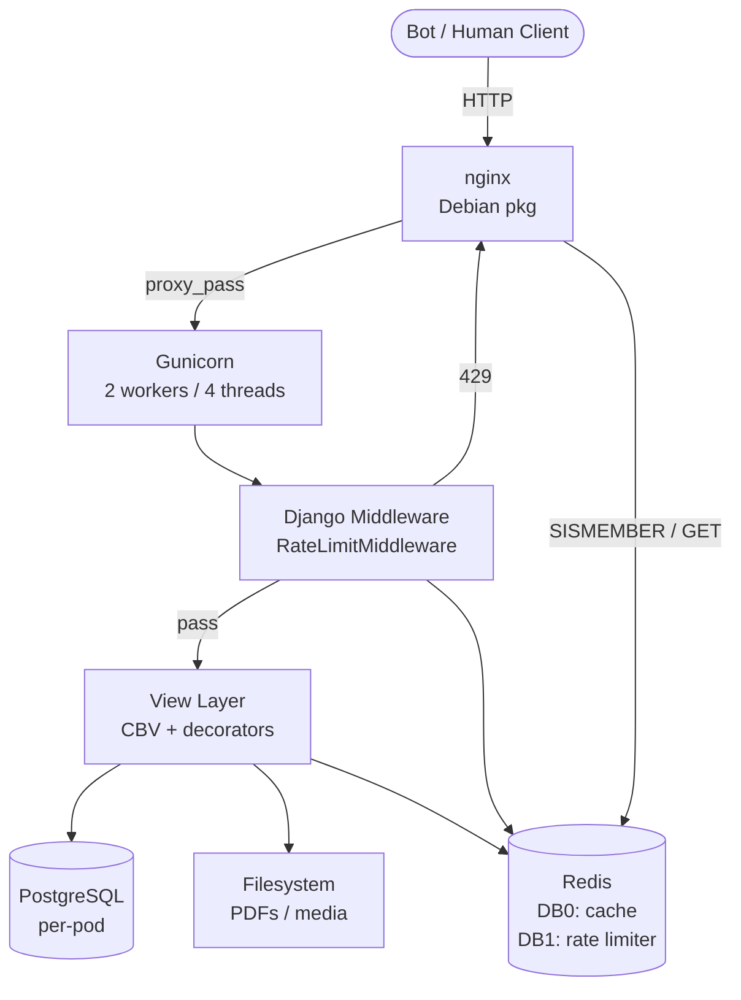

# SAPL — OOM Investigation & Remediation Plan (v2)

> **Scope**: Django 2.2 / Gunicorn / nginx / Kubernetes fleet of 1,200+ pods.  
> Each pod has a dedicated PostgreSQL instance. A K8s Ingress sits in front of all tenants.  
> **This document is canonical** — all earlier session notes are consolidated here.

---

## Table of Contents

1. [Architecture Overview](#0-architecture-overview)
2. [Context & Problem Statement](#1-context--problem-statement)
3. [Decision Log](#2-decision-log)
4. [Phase 0 — Immediate Hardening (No New Infra)](#3-phase-0--immediate-hardening-no-new-infra)
5. [Phase 1 — Shared Redis (Single Pod)](#4-phase-1--shared-redis-single-pod)
6. [Phase 2 — Rate Limiting & Bot Mitigation](#5-phase-2--rate-limiting--bot-mitigation)
7. [Phase 3 — File Serving Corrections](#6-phase-3--file-serving-corrections)
8. [Phase 4 — Dynamic Page Caching](#7-phase-4--dynamic-page-caching)
9. [Open Questions](#8-open-questions)

---

## 0. Architecture Overview

### 0.1 Component Diagram



> DB2 is reserved for Django Channels (WebSocket — future Phase 5).

### 0.2 Redis Memory Budget and Key Layout

| Key type | Key schema | TTL | DB | Est. size |
|---|---|---|---|---|
| Page / view cache | `cache:{ns}:<django-generated>` | 60–600 s | 0 | ~0.5 GB |
| Static cache (images/logos) | `cache:{ns}:static:{sha256}` | 3–24 h | 0 | ~2.4 GB |
| PDF cache (≤ 360 KB) | `cache:{ns}:file:{sha256}` | 1 h | 0 | ~0.9 GB |
| IP request counter | `rl:ip:{ip}:reqs` | 60 s | 1 | ~0.6 MB |
| IP blocked marker | `rl:ip:{ip}:blocked` | 300 s | 1 | ~0.06 MB |
| User request counter | `rl:{ns}:user:{id}:reqs` | 60 s | 1 | negligible |
| User blocked marker | `rl:{ns}:user:{id}:blocked` | 300 s | 1 | negligible |
| Path counter | `rl:{ns}:path:{sha256}:reqs` | 60 s | 1 | ~0.3 MB |
| UA deny list | `rl:bot:ua:blocked` | permanent SET | 1 | ~0.03 MB |
| NS/IP/window counter | `rl:ns:{ns}:ip:{ip}:w:{bucket}` | 60 s × 2 | 1 | ~0.6 MB |
| **Redis overhead (× 1.5)** | | | | ~1.6 GB |
| **Total ceiling** | | | | **~5 GB** |

**Key conventions:**
- `{ns}` = Kubernetes namespace (tenant identifier). All path and user keys include it.
- `{user}` / `{id}` = normalized user PK: `str(user.pk).lower().strip()`.
- Django `CACHES` uses `KEY_PREFIX: "cache:{ns}"` (e.g. `cache:sapl:`) to namespace all DB0 cache keys.  
  DB1 (rate limiter) uses raw `rl:*` keys — no prefix — for compatibility with the Lua / middleware INCR scripts.
- DB2 is reserved for Django Channels; allocate separately when WebSocket work resumes.

---

## 1. Context & Problem Statement

### Fleet

| Item | Detail |
|---|---|
| System | SAPL — Django 2.2, legislative management for Brazilian municipal chambers |
| Fleet | ~1,200 Kubernetes pods, each with a dedicated PostgreSQL pod |
| Pod limits | 1 core CPU (limit) / 35m (request) · 1600Mi RAM (limit) / 800Mi (request) |
| Users | Legislative house staff, often behind NAT (many users, one public IP) |
| Workloads | PDF generation (synchronous, ReportLab), file uploads up to 150 MB, WebSocket voting panel |

### OOM Kill Pattern

Workers grow from ~35 MB at birth to 800–900 MB within 2–3 minutes, then are killed and replaced in a continuous cycle.

Root causes:
- Bot scraping triggers synchronous PDF generation — entire document built in RAM (ReportLab)
- `worker_max_memory_per_child` only checks **between requests**; workers blocked on long requests are never recycled
- `TIMEOUT=300` lets bots hold threads for up to 5 minutes while memory accumulates
- 3 workers × 300 MB each = ~900 MB — breaching the 800Mi request threshold

### Bot Traffic Profile (Barueri pod, 16 days, 662k requests)

| Actor | Requests | % of total |
|---|---|---|
| Googlebot | ~154,000 | 23.2% |
| Chrome/98.0.4758 (spoofed scraper) | 90,774 | 13.7% |
| kube-probe (healthcheck) | 69,065 | 10.4% |
| meta-externalagent | 28,325 | 4.3% |
| GPTBot | 11,489 | 1.7% |
| bingbot | 7,639 | 1.1% |
| OAI-SearchBot + Applebot | 6,681 | 1.0% |
| **Total identified bots** | **~377,000** | **~56.9%** |

**Botnet fingerprint:**
- Rotates User-Agents (Chrome/121, Chrome/122, Firefox/123, Safari/17…) across requests
- Crawls all sub-endpoints of the same matéria within 1 second from different IPs
- Distributes crawling across tenants — each pod stays under the per-pod rate limit, never triggering it
- Primary targets: `/relatorios/{id}/etiqueta-materia-legislativa` (~40 KB PDF) and all `/materia/{id}/*` sub-endpoints

### Static File Traffic (from CSV analysis)

| Category | Requests | Transfers |
|---|---|---|
| Logos / images | 62,776 | ~24 GB |
| PDFs | 8,869 | 5.1 GB |
| Parliamentarian photos | 11,856 | ~0.5 GB |
| **Total** | **83,501** | **~30 GB** |

Top offender: `Brasão - Foz do Iguaçu.png` — 14,512 requests, 5.6 GB from a single 392 KB file.

### Confirmed Bugs

```nginx
# nginx.conf — WRONG (disables kernel bypass)
sendfile off;

# sapl.conf — missing on /media/ location
location /media/ {
    alias /var/interlegis/sapl/media/;
    # no ETag, no Cache-Control, no X-Robots-Tag
}
```

```python
# settings.py — per-pod cache, not shared
CACHES = {
    'default': {
        'BACKEND': 'django.core.cache.backends.filebased.FileBasedCache',
        'LOCATION': '/var/tmp/django_cache',
        'OPTIONS': {"MAX_ENTRIES": 10000},
    }
}
```

Django rate limiter (`django-ratelimit` at 35/m) uses `FileBasedCache` — counters are isolated per pod, making rate limiting completely ineffective at fleet scale.

### Hard Constraints

| Constraint | Impact |
|---|---|
| Per-pod PostgreSQL | Rate-limit counters not shared across pods |
| No Redis initially | No shared state for rate limiting or caching |
| NAT environments | IP-based rate limiting causes false positives |
| `TIMEOUT=300` / uploads to 150 MB | Must not be broken — intentional for slow workflows |

---

## 2. Decision Log

| Decision | Chosen | Rationale | Session |
|---|---|---|---|
| Redis topology | **Single pod** (no Sentinel, no Cluster) | 65 MB of active data fits comfortably on one node; cluster complexity not justified at this data volume | v2 |
| PDF caching in Redis | **No** — ETags + sendfile are sufficient | Once rate limiting + ETags are active, repeat requests become 304s with zero bytes transferred | Session 4 |
| nginx rate-limit end state | **Django middleware** with shared Redis | No nginx image changes required; solves cross-pod consistency immediately | Session 5 |
| `worker_max_memory_per_child` | **400 MB** | Pod limit 1600Mi, 2 workers × 400 MB = 800 MB — leaves 800 Mi headroom; previous 300 MB was OOMKilled before recycling could act | v2 |
| `sendfile off` | **Bug** — flip to `on` | No valid production reason found in uploaded config; disabling userspace copy is always correct | Session 5 |
| nginx serves `/media/` directly | Confirmed via `alias` in `sapl.conf` | `X-Accel-Redirect` only needed for LGPD-restricted documents | Session 5 |
| Cache backend switch timing | **At pod startup** via `start.sh` + waffle switch | Pod restart is acceptable; avoids per-request runtime overhead | Session 5 |
| Secret injection | Per-namespace Secret with `optional: true` | Enables gradual rollout; pod starts on file cache if Secret is absent | Session 5 |
| Redis k8s files location | `$PROJECT_ROOT/docker/k8s/` | Consistent with existing Docker artifacts in the repo | v2 |

---

## 3. Phase 0 — Immediate Hardening (No New Infra)

**Goal**: Stop the OOM kill cycle and reduce bot load with zero infrastructure additions.  
**Risk**: Low — all changes are config-only.

### 3.1 Gunicorn Tuning

The core tension: reducing workers protects memory but reduces concurrency. The fix is to reduce the **number** of workers (from 3 to 2) and raise the per-worker **ceiling** so the recycling mechanism has time to act.

```python
# docker/startup_scripts/gunicorn.conf.py
import os
import pathlib

NAME     = "SAPL"
DJANGODIR = "/var/interlegis/sapl"
SOCKFILE  = f"unix:{DJANGODIR}/run/gunicorn.sock"
USER  = "sapl"
GROUP = "nginx"

NUM_WORKERS = int(os.getenv("WEB_CONCURRENCY", "2"))      # was 3
THREADS     = int(os.getenv("GUNICORN_THREADS", "4"))      # was 8
TIMEOUT     = int(os.getenv("GUNICORN_TIMEOUT", "120"))    # was 300
WORKER_CLASS     = "gthread"
DJANGO_SETTINGS  = "sapl.settings"
WSGI_APP         = "sapl.wsgi:application"

proc_name = NAME
bind      = SOCKFILE
umask     = 0o007
user      = USER
group     = GROUP
chdir     = DJANGODIR
wsgi_app  = WSGI_APP

loglevel    = "info"          # was debug — reduces log I/O
accesslog   = "/var/log/sapl/access.log"
errorlog    = "/var/log/sapl/error.log"
capture_output = True

workers          = NUM_WORKERS
worker_class     = WORKER_CLASS
threads          = THREADS
timeout          = TIMEOUT
graceful_timeout = 30
keepalive        = 10
backlog          = 2048

max_requests        = 1000
max_requests_jitter = 200
worker_max_memory_per_child = 400 * 1024 * 1024  # 400 MB — was 300 MB

raw_env = [f"DJANGO_SETTINGS_MODULE={DJANGO_SETTINGS}"]
preload_app = False

def on_starting(server):
    pathlib.Path(SOCKFILE).parent.mkdir(parents=True, exist_ok=True)

def post_fork(server, worker):
    try:
        from django import db
        db.connections.close_all()
    except Exception:
        pass
```

**Per-location timeout strategy** — replace the one-size-fits-all 300s:

| Operation | Previous | Recommended | Rationale |
|---|---|---|---|
| Normal page rendering | 300 s | 60 s | No legitimate page should take > 60 s |
| API endpoints | 300 s | 30 s | Stateless, fast by design |
| PDF download (cached / nginx) | 300 s | 30 s | nginx serves from disk, worker not involved |
| PDF generation (uncached) | 300 s | 180 s | Kept high — addressed in Phase 5 |
| Large file upload | 300 s | 180 s | nginx buffers upload, worker processes after |

---

### 3.2 nginx Fixes

Three confirmed bugs in the uploaded config — all fixed here.

```nginx
# /etc/nginx/nginx.conf — http {} block

# FIX 1: kernel bypass (was off — CRITICAL)
sendfile    on;
tcp_nopush  on;
tcp_nodelay on;

# FIX 2: reduced timeouts (was 300s everywhere)
keepalive_timeout     75;
proxy_read_timeout    120s;    # overridden per-location for slow ops
proxy_connect_timeout 10s;
proxy_send_timeout    120s;

# Real client IP from X-Forwarded-For set by K8s Ingress
real_ip_header     X-Forwarded-For;
real_ip_recursive  on;
set_real_ip_from   10.0.0.0/8;
set_real_ip_from   172.16.0.0/12;
set_real_ip_from   192.168.0.0/16;
```

```nginx
# sapl.conf — FIX 3: add caching headers to /media/
location /media/ {
    alias  /var/interlegis/sapl/media/;
    sendfile on;
    etag on;
    add_header Cache-Control "public, max-age=86400, stale-while-revalidate=3600";
    add_header X-Robots-Tag  "noindex" always;
}
```

**Upload endpoints** — keep `proxy_request_buffering on` so nginx absorbs slow uploads before handing off to Gunicorn:

```nginx
location ~* ^/(protocoloadm/criar-protocolo|materia/.*upload|norma/.*upload) {
    proxy_request_buffering on;
    proxy_read_timeout  180s;
    proxy_send_timeout  180s;
    proxy_set_header X-Forwarded-For   $proxy_add_x_forwarded_for;
    proxy_set_header X-Forwarded-Proto $scheme;
    proxy_set_header Host              $http_host;
    proxy_redirect off;
    proxy_pass http://sapl_server;
}
```

---

### 3.3 Bot UA Blocklist in nginx

Blocks known bots at nginx — before any Gunicorn worker is allocated.

```nginx
# nginx.conf — http {} block
map $http_user_agent $bot_ua_blocked {
    default                    0;
    "~*GPTBot"                 1;
    "~*ClaudeBot"              1;
    "~*PerplexityBot"          1;
    "~*Bytespider"             1;
    "~*AhrefsBot"              1;
    "~*SemrushBot"             1;
    "~*DotBot"                 1;
    "~*meta-externalagent"     1;
    "~*OAI-SearchBot"          1;
    "~*Chrome/98\.0\.4758"     1;  # confirmed scraper — no real user runs a 2022 browser in 2026
}

# sapl.conf — server {} block (before any location)
if ($bot_ua_blocked = 1) {
    return 429 "Too Many Requests";
}
```

**Limitation**: Bots with rotating or spoofed UAs are not caught here. They are handled by Django middleware in Phase 2 (checks 3–5). This is intentional — nginx handles the cheap deterministic case; Django handles the expensive probabilistic case.

---

### 3.4 ASN-Based Blocking (Mandatory)

Blocks bot traffic by datacenter ASN — before UA parsing, before any Python process is touched.

**Step 1 — install the GeoIP2 module and database:**

```bash
# Debian / Ubuntu
apt install libnginx-mod-http-geoip2 libmaxminddb0 mmdb-bin

# Download GeoLite2-ASN (free MaxMind account required)
mkdir -p /etc/nginx/geoip
curl -sL "https://download.maxmind.com/app/geoip_download?edition_id=GeoLite2-ASN&license_key=YOUR_KEY&suffix=tar.gz" \
  | tar -xz --strip-components=1 --wildcards '*.mmdb' -C /etc/nginx/geoip/
```

**Step 2 — configure nginx:**

```nginx
# nginx.conf — top-level (outside http {})
load_module modules/ngx_http_geoip2_module.so;

# nginx.conf — http {} block
geoip2 /etc/nginx/geoip/GeoLite2-ASN.mmdb {
    $geoip2_asn_number autonomous_system_number;
    $geoip2_asn_org    autonomous_system_organization;
}

map $geoip2_asn_number $bot_asn {
    default  0;
    16509    1;  # Amazon AWS
    14618    1;  # Amazon AWS us-east
    8075     1;  # Microsoft Azure
    396982   1;  # Google Cloud
    20473    1;  # Vultr
    24940    1;  # Hetzner
    16276    1;  # OVH
    36352    1;  # ColoCrossing
    63949    1;  # Linode / Akamai
}

# sapl.conf — server {} block (before bot_ua_blocked check)
if ($bot_asn = 1) {
    return 429 "Too Many Requests";
}
```

**Step 3 — keep the database fresh** (host cron — no k8s CronJob):

```bash
# /etc/cron.weekly/update-geoip
#!/bin/bash
curl -sL "https://download.maxmind.com/app/geoip_download?edition_id=GeoLite2-ASN&license_key=${MAXMIND_KEY}&suffix=tar.gz" \
  | tar -xz -C /tmp --wildcards '*.mmdb'
mv /tmp/GeoLite2-ASN_*/GeoLite2-ASN.mmdb /etc/nginx/geoip/GeoLite2-ASN.mmdb
nginx -s reload
```

**Tradeoff**: Blocks datacenter ASNs where bots originate. May over-block VPN users and developers on cloud instances.

---

### 3.5 robots.txt

Passive mitigation — effective over days/weeks for compliant bots. The spoofed Chrome/98 botnet ignores it; handled by nginx UA blocking above.

```
# Place at /var/interlegis/sapl/collected_static/robots.txt
User-agent: GPTBot
Disallow: /
Crawl-delay: 10

User-agent: ClaudeBot
Disallow: /
Crawl-delay: 10

User-agent: meta-externalagent
Disallow: /
Crawl-delay: 10

User-agent: OAI-SearchBot
Disallow: /
Crawl-delay: 10

User-agent: *
Disallow: /relatorios/
Crawl-delay: 10
```

Serve directly from nginx (no Django involvement):

```nginx
# sapl.conf
location = /robots.txt {
    alias /var/interlegis/sapl/collected_static/robots.txt;
}
```

---

### 3.6 N+1 Fix in `get_etiqueta_protocolos`

Confirmed in `sapl/protocoloadm/utils.py` — `MateriaLegislativa.objects.filter()` called inside a loop over protocols. Two queries total regardless of volume:

```python
# BEFORE — one query per protocol (N+1)
def get_etiqueta_protocolos(prots):
    protocolos = []
    for p in prots:
        dic = {}
        for materia in MateriaLegislativa.objects.filter(
                numero_protocolo=p.numero, ano=p.ano):
            dic['num_materia'] = (
                materia.tipo.sigla + ' ' +
                str(materia.numero) + '/' + str(materia.ano)
            )
        protocolos.append(dic)
    return protocolos


# AFTER — two queries total regardless of volume
def get_etiqueta_protocolos(prots):
    from django.db.models import Q
    import functools, operator

    prot_list = list(prots)
    if not prot_list:
        return []

    query = functools.reduce(
        operator.or_,
        [Q(numero_protocolo=p.numero, ano=p.ano) for p in prot_list]
    )
    materias_map = {
        (m.numero_protocolo, m.ano): m
        for m in MateriaLegislativa.objects.filter(query).select_related('tipo')
    }

    protocolos = []
    for p in prot_list:
        dic = {}
        materia = materias_map.get((p.numero, p.ano))
        dic['num_materia'] = (
            f"{materia.tipo.sigla} {materia.numero}/{materia.ano}"
            if materia else ''
        )
        # ... rest of existing loop body unchanged
        protocolos.append(dic)
    return protocolos
```

---

### 3.7 ETags / 304 Responses

Adding `etag on` and `Cache-Control` to the `/media/` location (§3.2) converts repeat bot requests from full downloads to 304 responses with empty bodies.

For `Brasão - Foz do Iguaçu.png` (392 KB × 14,512 requests = **5.6 GB**), even a 50% conditional hit rate saves ~2.8 GB immediately — without any Redis.

**Why this is sufficient for PDFs**: See Phase 3 §6.2.

---

### 3.8 Django Upload Settings

```python
# sapl/settings.py
# Files above 2 MB are streamed to a temp file on disk rather than
# held in worker RAM. Critical for 150 MB upload support.
FILE_UPLOAD_MAX_MEMORY_SIZE = 2 * 1024 * 1024       # 2 MB
DATA_UPLOAD_MAX_MEMORY_SIZE = 10 * 1024 * 1024      # 10 MB
MAX_DOC_UPLOAD_SIZE         = 150 * 1024 * 1024     # 150 MB
FILE_UPLOAD_TEMP_DIR        = '/var/interlegis/sapl/tmp'
```

---

## 4. Phase 1 — Shared Redis (Single Pod)

**Goal**: Deploy Redis so all subsequent phases have shared state.  
**Risk**: Medium — new stateful infrastructure. Non-fatal fallback to file cache if Redis is unreachable.

### 4.1 Redis Kubernetes Manifests

Files live under `$PROJECT_ROOT/docker/k8s/`.

```yaml
# docker/k8s/redis-configmap.yaml
apiVersion: v1
kind: ConfigMap
metadata:
  name: redis-config
  namespace: redis
data:
  redis.conf: |
    save ""
    appendonly no

    maxmemory 5gb
    maxmemory-policy allkeys-lru
    maxmemory-samples 10

    maxclients 20000
    tcp-backlog 511
    timeout 300
    tcp-keepalive 60

    hz 20
    lazyfree-lazy-eviction yes
    lazyfree-lazy-expire yes
    lazyfree-lazy-server-del yes

    slowlog-log-slower-than 10000
    slowlog-max-len 256
    latency-monitor-threshold 10

    bind 0.0.0.0
    protected-mode no
    databases 4     # DB0: cache, DB1: rate limiter, DB2: channels (future)

    activedefrag yes
    active-defrag-ignore-bytes 100mb
    active-defrag-threshold-lower 10
```

```yaml
# docker/k8s/redis-pod.yaml
apiVersion: apps/v1
kind: Deployment
metadata:
  name: sapl-redis
  namespace: redis
spec:
  replicas: 1
  selector:
    matchLabels:
      app: sapl-redis
  template:
    metadata:
      labels:
        app: sapl-redis
    spec:
      containers:
      - name: redis
        image: redis:7-alpine
        command: ["redis-server", "/etc/redis/redis.conf"]
        resources:
          requests:
            memory: "1Gi"
            cpu: "250m"
          limits:
            memory: "6Gi"
            cpu: "1000m"
        ports:
        - containerPort: 6379
        volumeMounts:
        - name: redis-config
          mountPath: /etc/redis
      volumes:
      - name: redis-config
        configMap:
          name: redis-config
```

```yaml
# docker/k8s/redis-service.yaml
apiVersion: v1
kind: Service
metadata:
  name: sapl-redis
  namespace: redis
spec:
  selector:
    app: sapl-redis
  ports:
  - port: 6379
    targetPort: 6379
```

**Pod budget rationale:**

| Data type | Estimated memory |
|---|---|
| Rate limit counters (all pods, all IPs) | ~50–110 MB |
| View / template cache | ~300–600 MB |
| Small file cache (logos, etiquetas) | ~500 MB–1 GB |
| Redis overhead (× 1.5) | ~1.6 GB |
| **Total ceiling** | **~5 GB** |

---

### 4.2 Use-Case / Key-Prefix Mapping

| Use case | Key prefix | DB | TTL | Notes |
|---|---|---|---|---|
| Page / view cache | `cache:{ns}:*` | 0 | 60–600 s | `KEY_PREFIX=cache:{ns}` in Django CACHES |
| Static file cache (logos) | `cache:{ns}:static:{sha256}` | 0 | 3–24 h | ns = POD_NAMESPACE |
| PDF cache (≤ 360 KB) | `cache:{ns}:file:{sha256}` | 0 | 1 h | ns required |
| Rate limiter counters | `rl:*` | 1 | 60–300 s | Raw keys, no prefix |
| UA deny list | `rl:bot:ua:blocked` | 1 | permanent SET | Seed once after deploy |
| WebSocket / Channels | `channels:*` | 2 | session TTL | **Future — Phase 5** |

---

### 4.3 Django Settings — Startup-Time Backend Selection

```python
# sapl/settings.py
REDIS_URL     = config('REDIS_URL',     default='')
CACHE_BACKEND = config('CACHE_BACKEND', default='file')

_redis_ready = CACHE_BACKEND == 'redis' and bool(REDIS_URL)

CACHES = {
    'default': {
        'BACKEND': (
            'django_redis.cache.RedisCache' if _redis_ready
            else 'django.core.cache.backends.filebased.FileBasedCache'
        ),
        'LOCATION': REDIS_URL + '/0' if _redis_ready else '/var/tmp/django_cache',
        'KEY_PREFIX': f'cache:{POD_NAMESPACE}',  # e.g. "cache:sapl:" or "cache:sapl31demo-df:"
        **(
            {
                'OPTIONS': {
                    'CLIENT_CLASS': 'django_redis.client.DefaultClient',
                    'CONNECTION_POOL_KWARGS': {
                        # 1,200 pods × 2 workers × 6 = 14,400 peak connections
                        # maxclients=20,000 gives 40% headroom
                        'max_connections': 6,
                        'socket_timeout': 0.5,
                        'socket_connect_timeout': 0.5,
                    },
                    'IGNORE_EXCEPTIONS': True,  # cache miss on Redis failure — app degrades gracefully
                },
                'TIMEOUT': 300,
            } if _redis_ready else {
                'OPTIONS': {'MAX_ENTRIES': 10000},
            }
        ),
    },
    'ratelimit': {
        'BACKEND': 'django_redis.cache.RedisCache',
        'LOCATION': REDIS_URL + '/1' if _redis_ready else '',
        'OPTIONS': {
            'CLIENT_CLASS': 'django_redis.client.DefaultClient',
            'CONNECTION_POOL_KWARGS': {
                'max_connections': 6,
                'socket_timeout': 0.5,
                'socket_connect_timeout': 0.5,
            },
            'IGNORE_EXCEPTIONS': True,
        },
    } if _redis_ready else {
        'BACKEND': 'django.core.cache.backends.filebased.FileBasedCache',
        'LOCATION': '/var/tmp/django_ratelimit_cache',
        'OPTIONS': {'MAX_ENTRIES': 5000},
    },
}

RATELIMIT_USE_CACHE = 'ratelimit'
```

`start.sh` additions — resolve URL and read waffle switch before Gunicorn starts:

```bash
resolve_redis_url() {
    # 1. Already set by local Secret via envFrom — highest precedence
    [[ -n "${REDIS_URL:-}" ]] && { log "REDIS_URL from local secret."; return 0; }

    # 2. Try global cluster Secret via k8s API
    local api="https://kubernetes.default.svc"
    local token ca
    token="$(<'/var/run/secrets/kubernetes.io/serviceaccount/token')"
    ca="/var/run/secrets/kubernetes.io/serviceaccount/ca.crt"

    local url
    url=$(curl -sf --cacert "$ca" \
        -H "Authorization: Bearer $token" \
        "${api}/api/v1/namespaces/interlegis-infra/secrets/sapl-global-redis" \
        | python3 -c "
import sys, json, base64
d = json.load(sys.stdin).get('data', {})
v = d.get('REDIS_URL', '')
print(base64.b64decode(v).decode() if v else '')
" 2>/dev/null || echo "")

    if [[ -n "$url" ]]; then
        export REDIS_URL="$url"
        log "REDIS_URL from global cluster secret."
        return 0
    fi
    log "No REDIS_URL found — file-based cache will be used."
}

resolve_cache_backend() {
    [[ -z "${REDIS_URL:-}" ]] && return 0
    log "REDIS_URL set — checking REDIS_CACHE waffle switch..."
    local active
    active=$(psql "$DATABASE_URL" -At -v ON_ERROR_STOP=0 -c \
        "SELECT active FROM waffle_switch WHERE name='REDIS_CACHE' LIMIT 1;" \
        2>/dev/null || echo "")
    if [[ "$active" == "t" ]]; then
        log "REDIS_CACHE switch ON — activating Redis cache backend."
        export CACHE_BACKEND="redis"
    else
        log "REDIS_CACHE switch OFF — using file-based cache."
        export CACHE_BACKEND="file"
    fi
}

wait_for_redis() {
    [[ -z "${REDIS_URL:-}" ]] && return 0
    log "Checking Redis connectivity..."
    local host port
    host=$(python3 -c "from urllib.parse import urlparse; u=urlparse('${REDIS_URL}'); print(u.hostname or 'localhost')")
    port=$(python3 -c "from urllib.parse import urlparse; u=urlparse('${REDIS_URL}'); print(u.port or 6379)")
    local retries=10
    until python3 -c "import socket; s=socket.create_connection(('${host}',${port}),2); s.close()" 2>/dev/null; do
        retries=$((retries-1))
        [[ $retries -eq 0 ]] && { log "WARNING: Redis unreachable — continuing on file cache."; return 0; }
        log "Waiting for Redis... ($retries retries left)"
        sleep 2
    done
    log "Redis reachable at ${host}:${port}."
}

configure_redis_cache() {
    [[ -z "${REDIS_URL:-}" ]] && return 0
    log "Creating REDIS_CACHE waffle switch (default: off)"
    python3 manage.py waffle_switch REDIS_CACHE off --create
}
```

---

### 4.4 Rollout Sequence

```bash
# Enable Redis for one namespace
kubectl create secret generic sapl-redis \
  --namespace=fortaleza-ce \
  --from-literal=REDIS_URL="redis://sapl-redis.redis.svc.cluster.local:6379" \
  --dry-run=client -o yaml | kubectl apply -f -

kubectl exec -n fortaleza-ce deploy/sapl -- \
  python manage.py waffle_switch REDIS_CACHE on --create

kubectl rollout restart deployment/sapl -n fortaleza-ce

# Disable without removing secret
kubectl exec -n fortaleza-ce deploy/sapl -- \
  python manage.py waffle_switch REDIS_CACHE off
kubectl rollout restart deployment/sapl -n fortaleza-ce

# Fleet-wide rollout (parallel)
kubectl get namespaces -l app=sapl -o name | sed 's|namespace/||' | \
  xargs -P 10 -I{} kubectl exec -n {} deploy/sapl -- \
    python manage.py waffle_switch REDIS_CACHE on --create

kubectl get namespaces -l app=sapl -o name | sed 's|namespace/||' | \
  xargs -P 5 -I{} kubectl rollout restart deployment/sapl -n {}
```

**Seed the UA deny list once after Redis is deployed:**

```bash
kubectl exec -n redis deploy/sapl-redis -- redis-cli -n 1 \
  SADD rl:bot:ua:blocked \
    "$(echo -n 'GPTBot'          | sha256sum | cut -d' ' -f1)" \
    "$(echo -n 'ClaudeBot'       | sha256sum | cut -d' ' -f1)" \
    "$(echo -n 'PerplexityBot'   | sha256sum | cut -d' ' -f1)" \
    "$(echo -n 'Bytespider'      | sha256sum | cut -d' ' -f1)" \
    "$(echo -n 'AhrefsBot'       | sha256sum | cut -d' ' -f1)" \
    "$(echo -n 'meta-externalagent' | sha256sum | cut -d' ' -f1)"

# Add new offenders at runtime without restart
kubectl exec -n redis deploy/sapl-redis -- redis-cli -n 1 \
  SADD rl:bot:ua:blocked "$(echo -n 'NewBot/1.0' | sha256sum | cut -d' ' -f1)"
```

**Production monitoring commands:**

```bash
# Memory usage
kubectl exec -n redis deploy/sapl-redis -- redis-cli info memory \
  | grep -E 'used_memory_human|maxmemory_human|mem_fragmentation_ratio'

# Connection pressure
kubectl exec -n redis deploy/sapl-redis -- redis-cli info stats \
  | grep -E 'rejected_connections|instantaneous_ops_per_sec'

# Key distribution per DB
kubectl exec -n redis deploy/sapl-redis -- redis-cli info keyspace

# Slow log
kubectl exec -n redis deploy/sapl-redis -- redis-cli slowlog get 25
```

---

### 4.5 Inspecting Redis State

#### CLI quick-reference (redis-cli or `kubectl exec`)

```bash
# ── Connection ─────────────────────────────────────────────────────────────
# docker-compose
redis-cli -h localhost -p 6379

# k8s pod
kubectl exec -n <namespace> deploy/sapl-redis -- redis-cli

# ── DB selection (always specify -n for rate-limiter work) ─────────────────
# DB0 = page cache   DB1 = rate limiter   DB2 = channels (future)
redis-cli -n 1   # select DB1

# ── Key inspection ─────────────────────────────────────────────────────────
# List all rate-limiter keys
redis-cli -n 1 KEYS "rl:*"

# Request counter for a specific IP
redis-cli -n 1 GET "rl:ip:203.0.113.1:reqs"

# Remaining TTL on a counter
redis-cli -n 1 TTL "rl:ip:203.0.113.1:reqs"

# Check if an IP is hard-blocked
redis-cli -n 1 EXISTS "rl:ip:203.0.113.1:blocked"

# Authenticated user counter  (ns = POD_NAMESPACE, uid = user pk)
redis-cli -n 1 GET "rl:sapl:user:42:reqs"

# Namespace/IP sliding window (bucket = epoch // 60)
redis-cli -n 1 KEYS "rl:sapl:ip:203.0.113.1:w:*"

# ── Manual block / unblock ─────────────────────────────────────────────────
# Block an IP for 5 minutes
redis-cli -n 1 SET "rl:ip:1.2.3.4:blocked" 1 EX 300

# Immediately unblock an IP
redis-cli -n 1 DEL "rl:ip:1.2.3.4:blocked"

# Unblock a user
redis-cli -n 1 DEL "rl:sapl:user:42:blocked"

# ── Aggregate stats ────────────────────────────────────────────────────────
# Count all blocked IPs right now
redis-cli -n 1 KEYS "rl:ip:*:blocked" | wc -l

# Count all blocked users
redis-cli -n 1 KEYS "rl:*:user:*:blocked" | wc -l

# Total DB1 key count
redis-cli -n 1 DBSIZE

# Memory used by DB1
redis-cli INFO keyspace | grep "db1"

# ── Cache DB inspection (DB0) ───────────────────────────────────────────────
# Count cached page responses (KEY_PREFIX = cache:{ns}, e.g. "cache:sapl:")
redis-cli -n 0 KEYS "cache:sapl:*" | wc -l

# Memory used by DB0
redis-cli INFO keyspace | grep "db0"
```

#### RedisInsight

Open `http://localhost:5540` (or whatever port you mapped) and connect to:
- **Host**: `localhost` (or the k8s service name)
- **Port**: `6379`
- **Database**: switch between DB0 (cache) and DB1 (rate limiter) using the database selector

Filter keys by prefix `rl:ip:` to see all anonymous IP counters, `rl:*:user:` for authenticated users.

#### Populate synthetic test data

```bash
# Inject test entries to validate key schema and blocking thresholds
python3 docker/scripts/redis_inject_test_data.py

# Point at a non-default Redis
REDIS_URL=redis://sapl-redis.redis.svc:6379 python3 docker/scripts/redis_inject_test_data.py

# Clear all synthetic entries written by the script
CLEAR=1 python3 docker/scripts/redis_inject_test_data.py
```

---

## 5. Phase 2 — Rate Limiting & Bot Mitigation

**Goal**: Effective cross-pod throttling using shared Redis.  
**Prerequisite**: Phase 1 (Redis deployed and `CACHE_BACKEND=redis`).

### 5.1 Middleware Architecture

```mermaid
flowchart TD
    A([Request arrives at nginx]) --> B{SISMEMBER\nrl:bot:ua:blocked}
    B -->|hit| Z1[429 — zero Django cost]
    B -->|miss| C{GET\nrl:ip:blocked}
    C -->|exists| Z2[429 — zero Django cost]
    C -->|nil| D[proxy_pass to Gunicorn]
    D --> E{authenticated?}
    E -->|yes| F{INCR\nrl:{ns}:user:{id}:reqs\n>= 120/min?}
    E -->|no| G{suspicious\nheaders?}
    F -->|yes| Z3[SET user:blocked\n429]
    F -->|no| H[call view]
    G -->|yes| Z4[429]
    G -->|no| I{INCR\nrl:ip:reqs\n>= 30/min?}
    I -->|yes| Z5[SET ip:blocked\n429]
    I -->|no| J{INCR\nrl:ns:ip:window\n>= 30/min?}
    J -->|yes| Z6[SET ip:blocked\n429]
    J -->|no| H
    H --> K[Filesystem / ORM / Response]
```

### 5.2 RateLimitMiddleware Implementation

```python
# sapl/middleware/ratelimit.py
import hashlib
import logging
import time

from django.conf import settings
from django.core.cache import caches
from django.http import HttpResponse

logger = logging.getLogger('sapl.ratelimit')

BOT_UA_FRAGMENTS = [
    'GPTBot', 'ClaudeBot', 'PerplexityBot',
    'Bytespider', 'AhrefsBot', 'meta-externalagent',
    'Chrome/98.0.4758',
]


def _sha256(s: str) -> str:
    return hashlib.sha256(s.encode()).hexdigest()


def _is_suspicious_headers(request) -> bool:
    # Real browsers send all three; bots frequently omit them
    missing = sum([
        not request.META.get('HTTP_ACCEPT_LANGUAGE'),
        not request.META.get('HTTP_ACCEPT'),
        not request.META.get('HTTP_REFERER'),
    ])
    return missing >= 2


def _get_ip(request) -> str:
    return (
        request.META.get('HTTP_X_FORWARDED_FOR', '').split(',')[0].strip()
        or request.META.get('REMOTE_ADDR', '')
    )


class RateLimitMiddleware:
    ANON_IP_THRESHOLD   = 30    # req/min
    AUTH_USER_THRESHOLD = 120   # req/min
    BLOCK_TTL           = 300   # seconds

    def __init__(self, get_response):
        self.get_response = get_response
        self._rl_cache = caches['ratelimit']

    def __call__(self, request):
        decision = self._evaluate(request)
        if decision['action'] == 'block':
            logger.warning('ratelimit_block', extra={
                'ip':        decision['ip'],
                'reason':    decision['reason'],
                'ua':        request.META.get('HTTP_USER_AGENT', ''),
                'path':      request.path,
                'namespace': getattr(request, 'tenant', 'unknown'),
            })
            return HttpResponse(status=429)
        return self.get_response(request)

    def _evaluate(self, request):
        ip = _get_ip(request)

        # Check 1: known UA (all requests)
        ua = request.META.get('HTTP_USER_AGENT', '')
        for fragment in BOT_UA_FRAGMENTS:
            if fragment.lower() in ua.lower():
                return {'action': 'block', 'reason': 'known_ua', 'ip': ip}

        # Check 2: IP blocked marker
        if self._rl_cache.get(f'rl:ip:{ip}:blocked'):
            if not getattr(request, 'user', None) or not request.user.is_authenticated:
                return {'action': 'block', 'reason': 'ip_blocked', 'ip': ip}

        if getattr(request, 'user', None) and request.user.is_authenticated:
            return self._evaluate_authenticated(request, ip)
        return self._evaluate_anonymous(request, ip)

    def _evaluate_authenticated(self, request, ip):
        user_id = str(request.user.pk).lower().strip()
        ns = getattr(request, 'tenant', 'global')

        if self._rl_cache.get(f'rl:{ns}:user:{user_id}:blocked'):
            return {'action': 'block', 'reason': 'user_blocked', 'ip': ip}

        if _is_suspicious_headers(request):
            return {'action': 'block', 'reason': 'suspicious_headers_auth', 'ip': ip}

        count = self._incr_with_ttl(f'rl:{ns}:user:{user_id}:reqs', ttl=60)
        if count >= self.AUTH_USER_THRESHOLD:
            self._rl_cache.set(f'rl:{ns}:user:{user_id}:blocked', 1,
                               timeout=self.BLOCK_TTL)
            return {'action': 'block', 'reason': 'auth_user_rate', 'ip': ip}

        return {'action': 'pass', 'ip': ip}

    def _evaluate_anonymous(self, request, ip):
        # Check 3: suspicious headers
        if _is_suspicious_headers(request):
            return {'action': 'block', 'reason': 'suspicious_headers', 'ip': ip}

        # Check 4: IP request rate
        count = self._incr_with_ttl(f'rl:ip:{ip}:reqs', ttl=60)
        if count >= self.ANON_IP_THRESHOLD:
            self._rl_cache.set(f'rl:ip:{ip}:blocked', 1, timeout=self.BLOCK_TTL)
            return {'action': 'block', 'reason': 'ip_rate', 'ip': ip}

        # Check 5: per-ns/ip/window (catches UA rotators)
        ns     = getattr(request, 'tenant', 'global')
        bucket = int(time.time() // 60)
        count  = self._incr_with_ttl(f'rl:ns:{ns}:ip:{ip}:w:{bucket}', ttl=120)
        if count >= self.ANON_IP_THRESHOLD:
            self._rl_cache.set(f'rl:ip:{ip}:blocked', 1, timeout=self.BLOCK_TTL)
            return {'action': 'block', 'reason': 'ua_rotation', 'ip': ip}

        return {'action': 'pass', 'ip': ip}

    def _incr_with_ttl(self, key: str, ttl: int) -> int:
        """Atomic INCR + EXPIRE — TTL only set on key creation."""
        lua = """
            local n = redis.call('INCR', KEYS[1])
            if n == 1 then redis.call('EXPIRE', KEYS[1], ARGV[1]) end
            return n
        """
        client = self._rl_cache._cache.get_client()
        return client.eval(lua, 1, key, ttl)
```

---

### 5.3 Settings Reference

```python
# sapl/settings.py
MIDDLEWARE = [
    'sapl.middleware.ratelimit.RateLimitMiddleware',  # before session/auth
    'django.contrib.sessions.middleware.SessionMiddleware',
    # ... rest unchanged
]

RATE_LIMITER_RATE               = config('RATE_LIMITER_RATE',               default='35/m')
RATE_LIMITER_RATE_AUTHENTICATED = config('RATE_LIMITER_RATE_AUTHENTICATED', default='120/m')
RATE_LIMITER_RATE_BOT           = config('RATE_LIMITER_RATE_BOT',           default='5/m')

```

---

### 5.4 Enforcement Graduation Order

Roll out to canary pods first; promote check-by-check in order of false-positive risk:

| Order | Check | Risk | Condition to promote |
|---|---|---|---|
| 1st | `known_ua` | Zero | UA strings are deterministic |
| 2nd | `ip_blocked` | Zero | Key only set by prior proven-bad requests |
| 3rd | `ip_rate` | Low | Threshold calibrated from canary logs |
| 4th | `suspicious_headers` | Medium | Confirmed no legitimate clients omit all 3 headers |
| 5th | `ua_rotation` (ns/window) | Medium | |

---

### 5.5 Decorator Migration

For views where `django-ratelimit` decorators already exist:

| Endpoint type | Action | Reason |
|---|---|---|
| List views (GET) | Remove after Phase 2 stable | Middleware covers equivalent threshold |
| Detail views (GET) | Remove after Phase 2 stable | Middleware covers equivalent threshold |
| Search / filter views | Remove last | Expensive queries — keep stricter per-view limit |
| PDF / file generation | **Keep permanently** | Most expensive; per-view limit tighter than global |
| Write endpoints (POST/PUT/DELETE) | **Keep permanently** | Different abuse surface |
| Auth endpoints (login, reset) | **Keep permanently** | Credential stuffing; must be independent |

---

## 6. Phase 3 — File Serving Corrections

**Goal**: Ensure nginx serves files correctly with kernel bypass and caching headers.  
**Risk**: Low — config changes only.

### 6.1 Confirmed Architecture

nginx already serves `/media/` directly via `alias` — **Django is not involved in file serving for public media**. `X-Accel-Redirect` is only needed for LGPD-restricted documents that must pass through Django for access control.

The corrected `nginx.conf` and `sapl.conf` are shown in Phase 0 §3.2. No additional changes needed here.

### 6.2 Why Redis is NOT Needed for PDFs

With the full mitigation stack active:
- **ASN blocking** (Phase 0) drops datacenter bot traffic at nginx
- **UA blocking** (Phase 0) drops known-UA bots at nginx
- **Shared Redis rate counters** (Phase 2) enforce limits across all pods
- **ETags** (Phase 0 §3.2) convert repeat requests to 304 with zero bytes transferred
- **`sendfile on`** (Phase 0 §3.2) means disk reads bypass userspace entirely

Redis PDF caching would solve "high request volume reaching the file layer" — but that problem no longer exists once the above stack is active. Redis memory is better reserved for rate counters, page cache, and sessions.

### 6.3 File Serving Decision Matrix

| File type | Size | Strategy |
|---|---|---|
| Logos / images | Any | nginx `alias` + `sendfile` + ETag + `Cache-Control` |
| Small PDFs | ≤ 360 KB | nginx direct + ETag |
| Medium PDFs | 360 KB – 2 MB | nginx direct + ETag + rate limit |
| Large PDFs | > 2 MB | nginx + strict rate limit; never Redis |
| LGPD-restricted | Any | Django view → `X-Accel-Redirect` → nginx (access control enforced) |

---

## 7. Phase 4 — Dynamic Page Caching

**Goal**: Eliminate ORM queries for anonymous bot requests on list views.  
**Prerequisite**: Phase 1 (shared Redis, `CACHE_BACKEND=redis`).

### 7.1 The Key Insight

Many SAPL list views (`pesquisar-materia`, `norma`, etc.) are not truly dynamic for anonymous users between edits. A bot hammering `?page=1` through `?page=100` triggers 100 ORM queries per pod. With Redis page cache, each unique URL is queried once per TTL across the entire fleet.

```python
# views.py — apply to anonymous list views only
from django.views.decorators.cache import cache_page
from django.utils.decorators import method_decorator

@method_decorator(cache_page(60 * 5), name='dispatch')  # 5-minute TTL
class PesquisarMateriaView(FilterView):
    ...
```

> **Critical safety check**: `cache_page` sets `Cache-Control: private` for authenticated sessions automatically. Verify this is working before deploying — accidentally caching a session-aware response is a data leak.

### 7.2 Cache TTL Guidelines

| View type | TTL | Reasoning |
|---|---|---|
| Matéria list (anonymous) | 300 s | Changes infrequently between sessions |
| Norma list (anonymous) | 300 s | Same |
| Parlamentar list | 3600 s | Changes rarely |
| Search results | 60 s | Query-dependent, shorter TTL safer |
| Authenticated views | Never | `cache_page` respects this automatically |
| PDF generation | Never | Too large — serve from disk via nginx |

---

## 8. Open Questions

| # | Question | Status | Blocks |
|---|---|---|---|
| 1 | Does Chrome/98.0.4758 impersonator appear consistently in nginx access logs? | Needs investigation | Phase 0 UA block safety |
| 3 | Dockerfile scope | Single image for all tenants (confirmed). All path-based Redis keys include `{ns}`. | — |
| 4 | WebSocket voting panel priority | Separate project. Resumes after Redis is on k8s, bot siege addressed, and OOM pressure reduced. | Phase 5 sequencing |
| 5 | `CONN_MAX_AGE` tuning | Currently **300 s** (`sapl/settings.py:272`). Evaluate whether to reduce given worker recycling at 400 MB. | Phase 0 tuning |
| 6 | k8s Redis manifests | Development artifacts go under `$PROJECT_ROOT/docker/k8s/` (redis-pod.yaml, redis-service.yaml, redis-configmap.yaml). | Phase 1 delivery |

---

*Document consolidated from multi-session architecture review — Edward / Interlegis SAPL infrastructure.*
