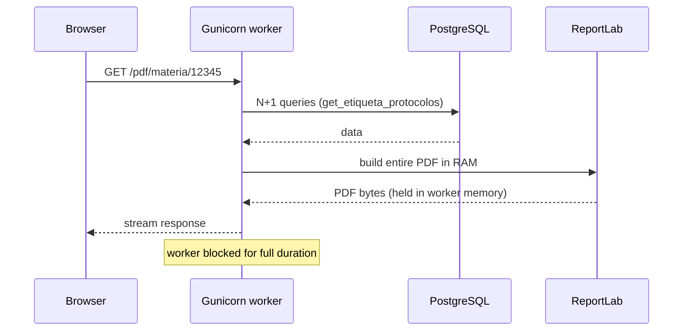
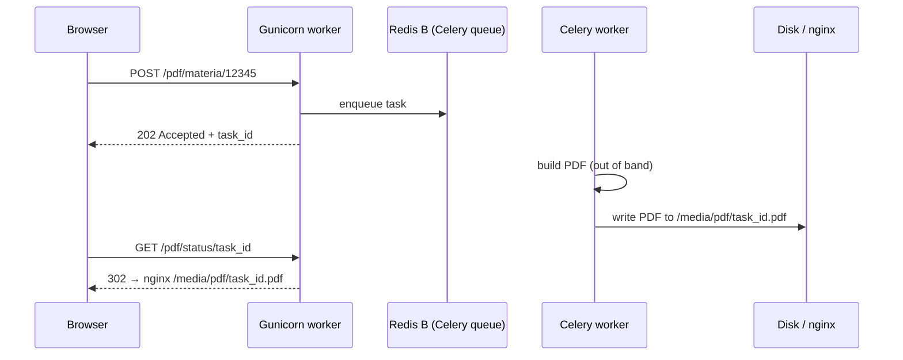

# SAPL — Work Queues & Real-Time: Async PDF + WebSocket Voting

> **Status**: Planned follow-up mini-project.  
> **Prerequisite**: Redis A (cache + rate-limiter pod, `rate-limiter-2026` branch) must be
> deployed to production, stable, and OOM pressure confirmed reduced before starting this work.  
> **Scope**: Django 2.2 / Gunicorn / Celery / Django Channels — same fleet of 1,200+ pods.

---

## Table of Contents

1. [Context & Motivation](#1-context--motivation)
2. [Redis Topology for Work Queues](#2-redis-topology-for-work-queues)
3. [Phase 1 — Async PDF via Celery](#3-phase-1--async-pdf-via-celery)
4. [Phase 2 — Django Channels (WebSocket Voting Panel)](#4-phase-2--django-channels-websocket-voting-panel)
5. [Open Questions](#5-open-questions)

---

## 1. Context & Motivation

After `rate-limiter-2026` ships:

| Remaining pain point | Current behaviour | Target |
|---|---|---|
| PDF generation | Holds a Gunicorn worker thread for the full build duration (10–60 s). Workers are at 400 MB cap — a PDF request burns one slot for up to a minute | Enqueue via Celery; respond 202 immediately; worker is freed |
| WebSocket voting panel | Not implemented; councillors use a polling page | Persistent connection via Django Channels backed by Redis |

---

## 2. Redis Topology for Work Queues

> **Critical constraint**: Celery broker **must** be a **separate** Redis instance (Redis B)
> with `noeviction` policy.  
> Redis A (cache + rate-limiter) uses `allkeys-lru` — tasks enqueued there would be silently
> evicted under memory pressure, causing jobs to vanish without error.

| Instance | Role | Eviction policy | Persistence |
|---|---|---|---|
| **Redis A** (existing) | Page cache (DB0), rate limiter (DB1), Django Channels (DB2) | `allkeys-lru` | none |
| **Redis B** (new) | Celery broker + result backend | `noeviction` | AOF + RDB snapshot |

```yaml
# docker/k8s/redis-celery-configmap.yaml
data:
  redis.conf: |
    maxmemory-policy noeviction   # never evict tasks
    appendonly yes                 # AOF persistence ON
    save "900 1"                   # RDB snapshot every 15 min if ≥1 change
    databases 2                    # DB0 = broker queue, DB1 = result backend
```

---

## 3. Phase 1 — Async PDF via Celery

### 3.1 Current (synchronous) flow

Holds worker memory for the entire PDF build:



### 3.2 Target (async) flow

Worker freed immediately after enqueueing:



### 3.3 Celery settings

```python
# sapl/settings.py additions
CELERY_BROKER_URL     = config('CELERY_BROKER_URL',     default='')
CELERY_RESULT_BACKEND = config('CELERY_RESULT_BACKEND', default='')

# Soft limit: warn at 350 MB; hard limit: kill+restart at 450 MB.
# Keeps Celery workers inside the same memory envelope as Gunicorn workers.
CELERY_WORKER_MAX_MEMORY_PER_CHILD = 400 * 1024  # KB
CELERY_TASK_SOFT_TIME_LIMIT = 120   # seconds — warn
CELERY_TASK_TIME_LIMIT      = 180   # seconds — SIGKILL
```

### 3.4 k8s manifests

New files to be created under `docker/k8s/`:

- `redis-celery-configmap.yaml` — Redis B config (noeviction, AOF)
- `redis-celery-deployment.yaml` — single-replica Redis B pod
- `redis-celery-service.yaml` — ClusterIP service
- `celery-deployment.yaml` — Celery worker deployment (same image as SAPL)

### 3.5 Environment variables (per-namespace Secret)

| Variable | Example value | Notes |
|---|---|---|
| `CELERY_BROKER_URL` | `redis://sapl-redis-celery.redis.svc:6379/0` | Redis B, DB0 |
| `CELERY_RESULT_BACKEND` | `redis://sapl-redis-celery.redis.svc:6379/1` | Redis B, DB1 |

---

## 4. Phase 2 — Django Channels (WebSocket Voting Panel)

Uses **Redis A DB2** (reserved in the existing key-layout table — no new infra needed beyond
what ships in `rate-limiter-2026`).

### 4.1 Channel layer settings

```python
# sapl/settings.py additions
CHANNEL_LAYERS = {
    "default": {
        "BACKEND": "channels_redis.core.RedisChannelLayer",
        "CONFIG": {
            "hosts": [("sapl-redis.redis.svc.cluster.local", 6379)],
            "db": 2,        # DB2 reserved for channels (see rate-limiter-v2.md §0.2)
            "capacity": 1500,
            "expiry": 10,
        },
    }
}
```

### 4.2 Prerequisites before starting

- [ ] Redis A stable in production (rate limiter + cache confirmed working)
- [ ] OOM kill rate reduced to near-zero
- [ ] Bot siege resolved (Phase 0–2 metrics reviewed)
- [ ] Decision on ASGI server (Daphne vs Uvicorn + channels) — Gunicorn alone cannot serve WebSockets

---

## 5. Open Questions

| # | Question | Blocks |
|---|---|---|
| 1 | Which PDF endpoints are highest priority for async migration? (`/relatorios/`, `/materia/pdf/`, other)? | Phase 1 scope |
| 2 | Should the Celery worker run in the same pod as Gunicorn (sidecar) or a dedicated deployment? | Phase 1 k8s design |
| 3 | Result backend TTL — how long should generated PDFs be retained before cleanup? | Phase 1 storage design |
| 4 | ASGI server selection for Channels (Daphne vs uvicorn + channels) | Phase 2 |
| 5 | WebSocket voting panel: is per-session or per-pod state acceptable? | Phase 2 architecture |

---

*Planned work — begins after `rate-limiter-2026` is stable in production.*
